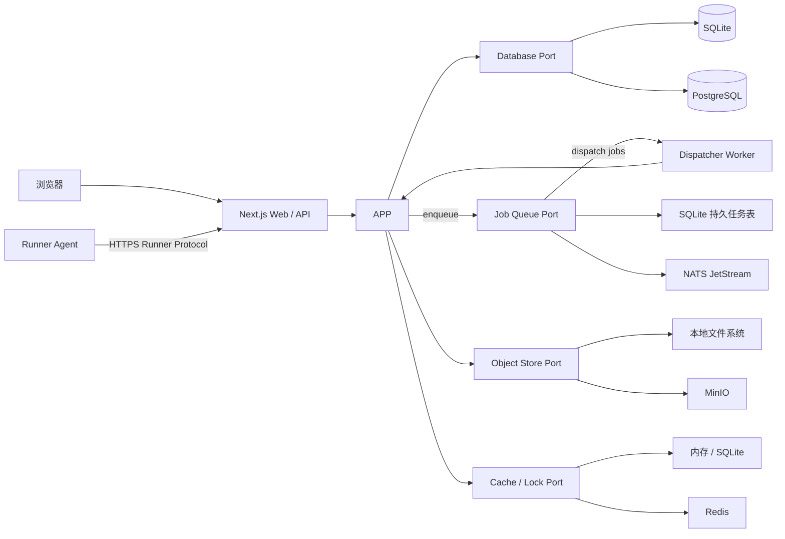

# AutoForge

AutoForge 是一个面向自动化测试场景的用例工厂，用于统一管理用例任务、执行单个或批量用例、管理执行机，并对执行结果进行检索、聚合和分析。执行机安装独立的 Runner Agent，由 Agent 领取任务、以受控子进程执行命令、采集日志和产物，再将结果上报控制面。

项目同时面向两类部署环境：

- **完整模式（Full）**：使用 PostgreSQL、NATS JetStream、MinIO 和 Redis，适合多执行机、较高并发和生产集群。
- **极简模式（Lite）**：仅需 Node.js 和一个可写数据目录；以 SQLite 保存业务数据和持久任务，本地文件系统保存产物，不依赖任何外部基础设施。

> 当前状态：用例资产、身份/RBAC、可选 LDAP 和控制面 Runner Protocol v1 已同时落地 Lite 与 Full 适配器。Go Runner Agent 已接入有界 claim、独立 lease 续租、启动 reconcile、权威测试/依赖 JAR 下载、离线 TestNG 类/方法执行、参数注入、cgroup v2/rlimit 资源限制、日志确认重传、安全产物上传、取消/进程组清理和幂等完成上报。严格磁盘配额、多租户隔离与分析闭环仍未完成，因此尚未达到生产验收标准。

完整的未完成事项、依赖顺序和阶段验收门见 [AutoForge 待办路线图](./Todo.md)。

## 当前已实现

- Next.js 16.3.0 App Router 主平台，采用已选方案 E 的 Apple-like Bento 工作台。
- TestNG JAR 上传、静态检查、导入和 SHA-256 去重。
- `CaseDefinition`、不可变 `CaseVersion`、测试方法契约及应用用例。
- Drizzle ORM + SQLite/PostgreSQL 持久化，两种方言使用独立版本化迁移；SQLite 启用外键、WAL 与 busy timeout。
- Lite 本地对象存储和 Full MinIO 对象存储：JAR 按内容摘要保存，页面只浏览 AutoForge 纳管的对象空间。
- JAR 来源列表、持久化扫描预览和唯一权威全量来源设置。
- 用例勾选、用例任务创建、任务详情以及任务内用例新增/删除。
- Runner Agent 注册、身份凭据落盘、周期心跳、在线/离线判定和执行机控制台。
- 批跑配置页面、执行环境快照、失败重跑上限，以及共享的资源感知调度算法。
- 项目级可复用执行环境使用不可变版本；非密文变量和密文版本引用在批次创建时固化，之后的环境编辑或密文轮换不会改变排队、重试或历史执行。密文值以 AES-256-GCM 保存且管理接口只返回元数据，Agent 仅凭有效 lease 按需领取到本次进程环境，明文不进入 assignment、日志或 spool。
- 批次执行前预检一次返回参数/变量、环境密文、Runner capability/标签、Java/TestNG 工具链、权威 JAR 对象和资源限制的逐项 blocker；正式创建复用相同规则，调度、claim 和下载仍执行权威复核。
- 本地账号首次管理员引导、scrypt 密码、本地/LDAP 登录、安全会话、锁定/解锁、密码恢复、六种内置角色和服务端 RBAC；批次、日志、Attempt 时间线、产物下载和取消按权威项目过滤，跨项目 ID 猜测不会读取内容。
- LDAP 的 LDAPS/StartTLS、私有 CA、多服务器、分页上限、即时建号、组角色映射、手动同步和离职停用；bind 密码使用主密钥加密，连接测试区分 DNS、TLS、超时、bind、Base DN、过滤器和读取权限故障。
- 用户管理支持 URL 驱动的搜索、来源筛选和游标分页，以及本地账号创建、启停/解锁、密码重置和按用户撤销全部会话；LDAP 管理属性不提供本地编辑入口。
- SQLite/PostgreSQL assignment、lease、状态事件、完成回执、日志水位和产物元数据，以及原子 claim、续租、回收、reconcile、取消、失败重排和批次聚合；冲突完成会保留事件证据，领取/lease/执行超时使用不同稳定结果码。
- Lite/Full 共用持久审计模型，覆盖身份、LDAP、来源/任务、批次/执行取消、Runner 和终端操作；自动重试审计与执行状态事务一致，详情只保留稳定 ID、结果码和计数等脱敏摘要。
- `packages/runner-sdk` 中的 Runner Protocol v1 输入校验、兼容协商和有界长轮询控制器。
- Agent 上报 CPU、内存、1 分钟负载与逻辑 CPU 数；调度阈值集中配置，过载或指标过期的节点不会获得新分配。
- Runner 页面展示 Agent/协议、Linux 架构、Java/TestNG 工具链与 cgroup v2 能力兼容性；不可变 `ExecutionSpec` 固化 Linux `amd64/arm64`、Java 11+ 和 TestNG 7.11.0 要求。不兼容节点在批次选择、服务端调度、assignment claim 和 Agent 本地校验四层被阻止，离线升级使用 Release 中对应架构的校验资产。批次、执行、尝试、assignment 和 lease 均以版本条件保护写入，批次与 attempt 状态历史可审计。
- 可选的 Agent 直连终端：方案 E 浮窗使用 xterm.js，登录会话通过独立 `runner.terminal` 权限换取一次性短时票据，再由同源 WebSocket 中继到 Agent 的受控 PTY；请求、开始、结束、断开原因和有界流量摘要进入持久审计，不记录命令内容或终端输出。
- Full 模式按需连接 PostgreSQL、NATS、MinIO、Redis，readiness 实际检查四项依赖；Lite 启动不加载 Full 客户端。
- `/api/v1` 管理接口，以及 liveness/readiness 健康检查。
- TestNG 解析单元测试、SQLite/PostgreSQL/本地对象/MinIO 集成测试和浏览器管理闭环测试；Agent 安全、日志/spool 与产物矩阵覆盖参数注入、越界 cwd、环境泄漏、失效凭据、资源/进程树清理、跨块、交错流、确认缺口、断线重传、重启、配额、脱敏、恶意路径、摘要冲突和对象故障恢复。
- Go 1.26 Runner Agent 的版本信息、配置诊断、受控工作目录、无 Shell 命令执行、日志上限、超时与 Linux 进程组清理。
- Agent 的有界 claim/退避/并发槽位、独立 lease 续租、重启 reconcile、权威测试/依赖 JAR 下载校验、离线工具链 capability，以及按 `methodName+JVM descriptor` 精确选择重载方法的 TestNG 完成上报。
- Agent stdout/stderr/诊断流的 UTF-8 分块、双层秘密脱敏、有界磁盘 spool、连续确认水位和断线重传。
- 产物安全发现、SHA-256 声明和鉴权下载；Lite 经控制面流式写入本地对象目录，Full 使用 15 分钟单对象 MinIO 预签名目标，Agent 不持有长期凭据，finalize 前由控制面重新核对大小和 SHA-256。TestNG XML 以禁用 DTD/实体的有界流式解析器提取 suite/test/class/method、耗时和汇总，结果由 SQLite/PostgreSQL 持久化并在执行详情展示，原始 XML 保留为产物。
- SQLite 持久任务和 Lite 嵌入式 worker；PostgreSQL transactional outbox、JetStream 显式确认和 Full 独立 worker。SQLite/JetStream 运行同一套至少一次投递契约测试，覆盖去重、延迟、租约恢复、死信和关闭排空。
- 可重建的 Lite 内存缓存与 Full Redis 缓存适配器；缓存不作为业务事实来源。
- GitHub Actions CI，以及后端离线镜像和 Agent 四变体 GitHub Release 流水线。

尚未实现：严格磁盘配额、多租户全量数据隔离、API 服务账号、LDAP 计划同步和分析页面。Full 的调度消息已使用 PostgreSQL outbox 与 JetStream，Redis 只承载可重建缓存和限流语义。

## TestNG JAR 用例发现

导入过程只读取 JAR 的 ZIP 目录和 JVM class 文件，不通过 class loader 加载或执行用户字节码。首版识别 `org.testng.annotations.Test` 与 `Ignore` 的运行时注解：方法级 `@Test` 直接形成测试方法；类级 `@Test` 将类中的 public 方法视为测试方法。`groups`、`enabled`、`description`、`dataProvider`、依赖组/方法与 `priority` 会写入版本快照。

映射规则为：一个 TestNG 测试类对应一个 `CaseDefinition`，每次导入形成不可变 `CaseVersion`，重载方法通过 JVM descriptor 区分。整个 JAR 以 SHA-256 去重；数据库目录和本地对象目录应作为同一备份集合。

当前扫描边界：

- 只解析字节码注解，不推断工厂、监听器或运行时动态生成的测试。
- 检测根目录 `testng.xml`，但尚不解析 suite 的 include/exclude、参数或 package 选择规则。
- 尚不解析 JAR 外部父类中的继承测试，也会忽略 `META-INF/versions` 中的多版本 class 并返回扫描警告。
- 执行快照必须包含一个权威测试 JAR，可附带最多 127 个权威依赖 JAR。有效 lease 的 Runner 只能经控制面下载快照声明的输入；控制面核对权威对象元数据，Agent 再校验总大小、相对 `.jar` 路径、可用空间和 SHA-256。类级执行直接使用 TestNG CLI，方法级执行使用离线内嵌 launcher 按 `methodName+JVM descriptor` 精确匹配 reflection 方法并注入有界参数。

当前 HTTP 接口：

| 方法     | 路径                                                      | 说明                                                 |
| -------- | --------------------------------------------------------- | ---------------------------------------------------- |
| `POST`   | `/api/v1/case-sources/jar/inspect`                        | 上传 `multipart/form-data` 的 `file`，只扫描不持久化 |
| `POST`   | `/api/v1/case-sources/jar/import`                         | 扫描、内容寻址保存并事务性导入用例                   |
| `GET`    | `/api/v1/case-definitions`                                | 游标分页查询用例，可使用 `query`、`cursor`、`limit`  |
| `GET`    | `/api/v1/case-sources`                                    | 查询 JAR 来源及权威全量来源状态                      |
| `GET`    | `/api/v1/case-sources/{sourceId}`                         | 读取已持久化的 JAR 扫描结果                          |
| `PUT`    | `/api/v1/case-sources/{sourceId}/authoritative`           | 将一个 JAR 设为唯一权威全量来源                      |
| `GET`    | `/api/v1/objects`                                         | 浏览本地对象目录或 MinIO bucket 中的受管对象         |
| `POST`   | `/api/v1/case-suites`                                     | 创建用例任务                                         |
| `GET`    | `/api/v1/case-suites/{suiteId}`                           | 查询用例任务及其用例                                 |
| `POST`   | `/api/v1/case-suites/{suiteId}/cases`                     | 批量添加勾选用例                                     |
| `DELETE` | `/api/v1/case-suites/{suiteId}/cases/{caseDefinitionId}`  | 删除任务内用例                                       |
| `POST`   | `/api/v1/runner-agents/register`                          | 使用 bootstrap token 注册 Agent                      |
| `POST`   | `/api/v1/runner-agents/{runnerId}/heartbeat`              | Agent 认证心跳与容量上报                             |
| `GET`    | `/api/v1/runners`                                         | 查询执行机及在线状态                                 |
| `GET`    | `/api/v1/run-batches`                                     | 查询批跑调度记录                                     |
| `POST`   | `/api/v1/run-batches`                                     | 创建批次并尝试资源感知分配                           |
| `POST`   | `/api/v1/run-batches/preflight`                           | 返回创建前逐项配置阻塞原因                           |
| `GET`    | `/api/v1/run-batches/{batchId}`                           | 查询批次、ExecutionRun 与 RunAttempt                 |
| `POST`   | `/api/v1/run-batches/{batchId}/cancel`                    | 取消批次及其未完成执行                               |
| `POST`   | `/api/v1/runner-agents/{runnerId}/claims`                 | 认证长轮询并原子领取 assignment                      |
| `POST`   | `/api/v1/runner-agents/{runnerId}/leases/{leaseId}/renew` | 续租并获取取消/排空指令                              |
| `POST`   | `/api/v1/runner-agents/{runnerId}/reconcile`              | Agent 重启后的 attempt 恢复协商                      |
| `POST`   | `/api/v1/run-attempts/{attemptId}/complete`               | 幂等完成上报与失败重排                               |
| `GET`    | `/api/v1/run-attempts/{attemptId}/events`                 | 有界游标查询 claim、完成、取消和超时事件             |
| `GET`    | `/api/v1/run-attempts/{attemptId}/logs`                   | 分页查询 stdout、stderr 或 Agent 日志                |
| `GET`    | `/api/v1/run-attempts/{attemptId}/artifacts`              | 查询执行产物及受控下载入口                           |
| `POST`   | `/api/v1/terminal-sessions`                               | 登录用户按 RBAC 换取一次性 WebSocket 会话票据        |
| `WS`     | `/api/v1/terminal-stream`                                 | 中继浏览器终端与 Agent 主动建立的终端通道            |
| `GET`    | `/api/v1/health/live`                                     | 进程存活检查                                         |
| `GET`    | `/api/v1/health/ready`                                    | 检查当前模式要求的数据库、对象存储及 Full 服务       |

## 批跑动态调度

“用例批跑”页面按“选择用例任务 → 勾选执行机 → 设置失败重跑次数 → 填写非密文测试环境变量 → 开始调度”创建批次。每个启用用例固化为一个 `ExecutionRun`；平台只在用户勾选范围内选择 Runner，并根据在线状态、资源快照新鲜度、空闲并发槽位、CPU、内存和 1 分钟单位 CPU 负载进行准入与评分。每次心跳会继续尝试分配等待资源的用例。排队、领取、执行和上传收尾分别使用持久化 UTC deadline 与稳定结果码，服务重启后由同一恢复扫描继续裁决。

`scheduled` 表示 assignment 已持久化但尚未领取，`running` 表示 Agent 已取得有效 lease。Agent 已接入 claim、续租、取消、reconcile、日志/产物上传和完成上报；执行详情页可分页读取三类日志、下载已上传产物并查看 Attempt 状态时间线。精确评分、并发防超卖、双模式语义和失败重跑边界见[批跑动态调度设计](./docs/architecture/run-scheduling.md)。

## 核心目标

- 集中管理自动化用例、版本、标签、参数和执行策略。
- 支持单个执行、批量执行、失败重试、取消、超时和结果追踪。
- 管理本机或远程执行机的注册、心跳、能力、标签、容量和状态。
- 提供可离线安装的 Runner Agent，以受控命令、环境和工作目录执行用例。
- 保存日志、报告、截图、录像等执行产物，并提供趋势与失败分析。
- 完整模式支持水平扩展，执行任务采用至少一次投递和幂等消费。
- 在无公网环境中完成安装、升级、运行、备份和恢复。
- 保证极简模式是长期受支持的产品形态，而不是仅用于演示的降级版本。

## 目标功能范围

### 用例与任务管理

- 用例定义、版本、标签、分组和启停状态。
- 参数模板、环境变量、密文引用与执行前校验。
- 单个或批量创建执行任务。
- 优先级、并发度、重试、超时和取消策略。
- 执行时固化用例版本与参数快照，避免后续编辑影响历史结果。

### 执行管理

- 本地执行与远程执行机调度。
- 按执行机标签、能力和可用容量匹配任务。
- 心跳、失联检测、租约续期与任务回收。
- 日志流、阶段进度、结构化结果和执行产物上传。
- 至少一次执行语义；依靠幂等键和状态机处理重复交付。

### 执行机管理

- 执行机注册、认证、禁用和注销。
- 操作系统、架构、运行器版本及自定义能力上报。
- 在线状态、当前负载、最近心跳和任务历史。
- 执行机分组、标签选择和并发上限。
- Runner Agent 领取任务、续租、响应取消并清理子进程树。
- stdout/stderr 有序采集、秘密脱敏、断线落盘和恢复重传。
- 按白名单规则收集报告、截图等产物，并校验数量、大小和 SHA-256。

### 分析与可观测性

- 成功率、失败率、耗时分位数和趋势分析。
- 按项目、用例、标签、执行机、时间范围和失败类型筛选。
- 批次对比、失败聚类和不稳定用例识别。
- 任务审计、状态变更历史和可关联的结构化日志。

## 前端设计方向

AutoForge 已选择方案 E 作为视觉基线：Apple-like 的轻盈桌面 Web 应用、Bento 式信息分组、柔和层次和高可读性。这里的 Apple-like 仅表示视觉语言方向，不复制 Apple Logo、专有图标或产品资产。


颜色 token、页面框架、核心组件、响应式策略、可访问性和实施顺序见[前端设计方案](./docs/design/frontend-design.md)。概念图不是页面背景或像素级实现稿，实际页面必须使用真实组件和业务状态。

## 双模式架构

两种模式共享领域模型、应用服务、API 和前端页面，只替换基础设施适配器。业务代码不得通过判断部署模式形成两套实现。

| 能力             | Lite                                         | Full                           |
| ---------------- | -------------------------------------------- | ------------------------------ |
| Web/API          | 单个 Next.js 进程                            | 一个或多个 Next.js 实例        |
| 后台任务         | 进程内工作器 + SQLite 持久队列               | 独立工作器 + NATS JetStream    |
| 业务数据库       | SQLite                                       | PostgreSQL                     |
| 产物存储         | 本地文件系统                                 | MinIO（S3 API）                |
| 缓存/限流/短租约 | 进程内存或 SQLite                            | Redis                          |
| Runner Agent     | 同发布包本地伴随进程；也可连接少量远程 Agent | 独立部署多个 Agent             |
| 执行机规模       | 单机或少量低并发执行机                       | 多执行机、水平扩展             |
| 外部服务依赖     | 无                                           | PostgreSQL、NATS、MinIO、Redis |



### Lite 模式（目标形态）

Lite 是默认开发模式，也是低资源环境的正式部署模式：

- 单个发布包包含 Web/API 和进程内任务工作器。
- 本地 Runner Agent 由同一发布包作为伴随进程启动，也可以让少量远程 Agent 通过控制面接入。
- SQLite 使用 WAL、busy timeout 和短事务；部署时只允许一个应用写入节点。
- 调度任务存入 SQLite 队列表；工作器消费后持久化 assignment，Runner Agent 再通过执行租约领取；进程异常退出后可回收过期任务或租约。
- 产物写入 `AUTOFORGE_DATA_DIR` 下的本地对象目录，数据库只保存元数据和内容校验值。
- 缓存不参与正确性判断；进程重启后允许丢失并自动重建。
- 启动路径不得导入、连接或探测 PostgreSQL、NATS、MinIO、Redis。

Lite 不承诺多应用实例横向扩展。需要多实例或大量执行机时，应迁移到 Full。

### Full 模式

Full 面向生产和集群环境：

- PostgreSQL 已保存当前用例资产、用例任务和 Runner 状态，使用独立迁移历史。
- MinIO 已保存和浏览 JAR 对象，接口语义与 Lite 本地对象存储一致。
- 创建批次时在同一 PostgreSQL 事务写入 outbox；独立 worker 幂等发布到 JetStream，持久化 assignment 后确认消息。
- Redis 实现命名空间、租户和 schema 版本隔离的可重建缓存，并承载 Runner 请求限速；执行事实始终保存在 PostgreSQL。

MinIO 上游仓库已于 2026 年 4 月归档。AutoForge 继续通过标准 S3 兼容接口支持用户指定的 MinIO 方案，但生产部署必须锁定已验证版本和摘要，并单独评估安全维护、升级来源与替代发行版。

### Runner Agent 与控制面协议

生产 assignment 要求 Runner 上报 `isolation:cgroup-v2`。该 capability 只在配置 cgroup 根后出现；启动 doctor 还会验证 `cpu`、`memory`、`pids` controller 的真实委派和子 cgroup 写权限。每个 attempt 在用户 Java 启动前进入独立 cgroup，CPU 使用 `cpu.max`、内存使用 `memory.max` 且禁用 swap、任务数使用 `pids.max`；包装进程同时设置 `RLIMIT_FSIZE`、`RLIMIT_NOFILE` 并禁用 core dump。工作目录总字节数和条目数每 100ms 扫描，超限后终止整个 cgroup。普通目录的扫描无法阻止两次采样间的瞬时超写；需要严格磁盘容量隔离时，部署方还必须为数据目录配置专用文件系统或项目配额。

Runner Agent 是安装在执行机上的 Go 守护进程。`start` 会通过 bootstrap token 注册、以 `0600` 权限保存身份和在途 attempt，发送 Linux CPU、内存和负载快照，并运行有界 assignment claim 与独立 lease 续租循环。Agent 只在离线 Java/TestNG 工具链配置完整时上报精确版本 capability；领取后经控制面下载一个权威测试 JAR 和有界依赖 JAR 集，逐项校验路径、大小与 SHA-256，并在传输前校验总磁盘限制和可用空间，再在独立工作目录中以确定性 classpath 参数调用 Java，不经过 Shell。启动时先 reconcile 本地状态，未获服务端决定不会自行重跑。日志在写入有配额的本地 spool 前脱敏，控制面再次脱敏并只确认连续序号；产物在工作目录内发现、校验和上传。

最终协议仍坚持 Agent 只主动连接 AutoForge 控制面，不直接访问业务数据库、NATS、Redis，也不持有 MinIO 长期凭据，因此同一个 Agent 将连接 Lite 或 Full。

一次执行的基本流程：

```text
claim -> prepare -> start -> stream logs -> collect artifacts -> report result -> cleanup
                 |                    |
                 -> cancel/timeout ---+
```

- 通过一次性 bootstrap token 注册，之后使用可撤销、可轮换的 Runner 身份。
- 使用有界长轮询领取 assignment，通过独立 lease 续期并获取取消/排空指令。
- 命令使用 `executable + args[]` 表示，默认 `shell: false`；复杂脚本作为带摘要的输入文件下发。
- 每次 attempt 使用独立工作目录，限制 cwd、环境变量、执行时间、日志和产物大小。
- stdout/stderr 分流并按序号批量上报，断线时写入有界本地 spool，恢复后从确认水位重传。
- 产物先校验路径、符号链接、大小、数量和 SHA-256，再写入共享配额的原子 spool 并通过受控上传目标提交；重启 reconcile 会先续传未确认产物，再重用原 completion ID 完成上报。
- 心跳只表示 Agent 活性，lease 才代表某次 attempt 的有效执行权。
- Agent 重启后必须先与控制面 reconcile，不得自行重跑未确认任务。

完整的组件、协议草案、安全模型、日志语义和测试要求见 [Runner Agent 架构设计](./docs/architecture/runner-agent.md)。

### 能力端口

核心应用仅依赖下列端口，不直接依赖具体 SDK：

```ts
interface DatabasePort {}
interface JobQueuePort {}
interface ObjectStorePort {}
interface CachePort {}
interface LeasePort {}
interface RunnerControlPort {}
```

端口的真实接口会随领域建模细化。首要约束是：PostgreSQL、NATS、MinIO、Redis 或 SQLite 的客户端类型不得泄漏到领域层和应用层。

## 任务状态与交付语义

建议的执行状态机：

```text
queued -> dispatching -> running -> succeeded
   |          |             |  \-> failed
   |          |             \----> timed_out
   |          \------------------> queued（租约过期/可重试）
   \------------------------------> cancelled
```

- 状态只能通过领域服务执行合法迁移。
- 每次投递携带稳定的 `runId`、`attempt` 和幂等键。
- 每个异步阶段必须先持久化其结果，再确认对应队列消息；调度消息在 assignment 持久化后确认，不跨越整个远程执行周期。
- Agent 领取后的执行权由 lease 管理；完成结果持久化后才向 Agent 确认完成上报。
- 重复结果不得重复计数、重复生成分析数据或覆盖已确认的终态。
- 取消是协作式操作；执行机必须定期检查取消信号并终止子进程。

## 技术基线

| 类别         | 选择                                                                 |
| ------------ | -------------------------------------------------------------------- |
| 运行时       | Node.js 24 LTS，约束为 `>=24 <25`                                    |
| 主平台       | Next.js 16 App Router + React + TypeScript strict                    |
| Runner Agent | Go 1.26.x；发布工具链固定为 Go 1.26.5；使用 HTTPS Runner Protocol v1 |
| 包管理       | pnpm workspace，提交唯一锁文件                                       |
| 数据访问     | Drizzle ORM；PostgreSQL 与 SQLite 使用独立驱动和迁移                 |
| 消息         | NATS JetStream                                                       |
| 对象存储     | MinIO / 本地文件系统适配器                                           |
| 缓存         | Redis / 进程内存与 SQLite 适配器                                     |
| 校验         | Zod（环境变量、API 输入和消息载荷）                                  |
| 测试         | Vitest + Playwright + Go test + 双模式集成测试                       |

截至 2026-08-09，当前实现使用 Node.js 24 LTS 与 Next.js 16.3.0。实际依赖均在 `package.json` 中锁定具体版本，并以 `pnpm-lock.yaml` 为准；不得在可复现构建中使用浮动的 `latest` 标签。

## 规划中的仓库结构

```text
autoforge/
├── apps/
│   ├── web/                    # Next.js 页面、Route Handlers、Server Actions
│   ├── worker/                 # Full 独立工作器；Lite 可由 Web 进程嵌入
│   └── runner-agent/           # 执行机守护进程、命令执行、日志与产物采集
├── packages/
│   ├── domain/                 # 实体、值对象、状态机、领域错误
│   ├── application/            # 用例编排和端口定义
│   ├── contracts/              # API、事件、任务载荷及版本
│   ├── testng-discovery/       # JAR 与 JVM class 静态解析
│   ├── db/                     # PostgreSQL/SQLite schema、迁移与仓储适配器
│   ├── queue/                  # JetStream/SQLite 队列适配器
│   ├── object-store/           # MinIO/本地文件系统适配器
│   ├── cache/                  # Redis/内存/SQLite 适配器
│   ├── runner-sdk/             # 执行机协议、认证和心跳客户端
│   ├── executors/              # process/container 执行器及共享安全策略
│   ├── ui/                     # 可复用 UI 组件
│   └── config/                 # 类型化配置和共享工具链配置
├── deploy/
│   ├── compose/                # Full/Lite Compose 与环境模板
│   └── offline/                # 离线镜像清单、校验和与安装脚本
├── docs/
│   ├── architecture/           # 架构说明和 ADR
│   ├── design/                 # UI 设计规范和已选视觉资产
│   └── operations/             # 部署、升级、备份、恢复和排障
├── tests/
│   ├── integration/
│   └── e2e/
├── AGENTS.md
└── README.md
```

这是一份目标结构。只有在对应代码加入仓库时才创建目录，避免预先生成空目录。

## 配置约定

应用只通过集中配置选择适配器。当前可用变量以 `.env.example` 为准：

| 变量                                           | 默认值     | 说明                                                 |
| ---------------------------------------------- | ---------- | ---------------------------------------------------- |
| `AUTOFORGE_MODE`                               | `lite`     | `lite` 或 `full`；模式只在组合根选择适配器           |
| `AUTOFORGE_DATA_DIR`                           | `./data`   | Lite 数据库、对象和临时文件根目录                    |
| `AUTOFORGE_MAX_JAR_BYTES`                      | `33554432` | 单个 JAR 的最大字节数，范围 1 MiB–256 MiB            |
| `AUTOFORGE_RUNNER_BOOTSTRAP_TOKEN`             | 未设置     | 至少 32 字符；一个值只允许成功注册一台 Runner        |
| `AUTOFORGE_RUNNER_CLAIM_RATE_LIMIT_PER_MINUTE` | `120`      | 单台 Runner 每分钟 claim 请求上限，范围 1–10000      |
| `AUTOFORGE_ADMIN_BOOTSTRAP_TOKEN`              | 未设置     | 首位系统管理员的一次性离线引导令牌                   |
| `AUTOFORGE_MASTER_KEY`                         | 未设置     | Base64 编码的 32 字节主密钥，用于 LDAP 与执行密文    |
| `AUTOFORGE_SESSION_TTL_HOURS`                  | `12`       | 登录会话有效期，范围 1–168 小时                      |
| `AUTOFORGE_TERMINAL_ACCESS_TOKEN`              | 未设置     | Web/终端网关内部签名密钥；不是用户登录凭据           |
| `AUTOFORGE_SCHEDULER_MAX_CPU_PERCENT`          | `85`       | 新分配允许的最大 CPU 使用率，范围 1–100              |
| `AUTOFORGE_SCHEDULER_MAX_MEMORY_PERCENT`       | `85`       | 新分配允许的最大内存使用率，范围 1–100               |
| `AUTOFORGE_SCHEDULER_MAX_LOAD_PER_CPU`         | `1`        | 1 分钟负载除以逻辑 CPU 数后的最大值，范围 0.1–100    |
| `AUTOFORGE_SCHEDULER_METRICS_MAX_AGE_SECONDS`  | `45`       | 资源快照最长有效期，范围 15–300 秒                   |
| `AUTOFORGE_DATABASE_URL`                       | 无         | Full PostgreSQL URL                                  |
| `AUTOFORGE_NATS_SERVERS`                       | 无         | Full NATS 地址，多个地址以逗号分隔                   |
| `AUTOFORGE_REDIS_URL`                          | 无         | Full `redis://` 或 `rediss://` URL                   |
| `AUTOFORGE_MINIO_*`                            | 无         | Full endpoint、access key、secret key、bucket/region |

规则：

- 配置在进程启动时一次性解析，非法配置应立即失败并给出可操作的错误。
- Full 缺少必要连接信息时拒绝启动；Lite 不读取 Full 专用变量。
- 任何密钥、令牌和带凭据的 URL 都不得写入日志。
- 默认值必须适合本地离线运行，不得指向公网服务。

Runner Agent 使用独立配置，不复用服务端数据库或基础设施凭据：

| 变量                                    | 说明                                             |
| --------------------------------------- | ------------------------------------------------ |
| `AUTOFORGE_SERVER_URL`                  | Agent 要连接的控制面地址                         |
| `AUTOFORGE_AGENT_DATA_DIR`              | Agent 身份、spool 和工作目录根路径               |
| `AUTOFORGE_AGENT_NAME`                  | 用户可识别的执行机名称                           |
| `AUTOFORGE_AGENT_LABELS`                | 调度标签                                         |
| `AUTOFORGE_AGENT_MAX_CONCURRENCY`       | 本机最大并发                                     |
| `AUTOFORGE_AGENT_CGROUP_ROOT`           | 委派的 cgroup v2 根；systemd 部署使用 `auto`     |
| `AUTOFORGE_AGENT_CLAIM_WAIT`            | claim 长轮询时长，范围 1s–30s；默认 20s          |
| `AUTOFORGE_AGENT_CLAIM_MAX_BACKOFF`     | claim 失败指数退避上限；默认 30s                 |
| `AUTOFORGE_AGENT_SHUTDOWN_GRACE`        | 停止领取后等待在途任务的时间；默认 30s           |
| `AUTOFORGE_AGENT_SPOOL_MAX_BYTES`       | 日志、结果和上传文件共享配额；默认 512 MiB       |
| `AUTOFORGE_AGENT_SPOOL_RETENTION`       | 无未决 attempt 的孤立日志保留期；默认 7 天       |
| `AUTOFORGE_AGENT_LOG_UPLOAD_BATCH`      | 单次日志上传块数；范围 1–256，默认 128           |
| `AUTOFORGE_AGENT_BOOTSTRAP_TOKEN`       | 仅首次注册使用，成功后移除                       |
| `AUTOFORGE_AGENT_CA_FILE`               | 离线内网私有 CA 文件                             |
| `AUTOFORGE_AGENT_JAVA_EXECUTABLE`       | 预置 Java 可执行文件绝对路径；与下列三项同时配置 |
| `AUTOFORGE_AGENT_TESTNG_CLASSPATH`      | 预置 TestNG 及依赖的系统路径分隔列表             |
| `AUTOFORGE_AGENT_JAVA_VERSION`          | capability 使用的精确 Java 版本                  |
| `AUTOFORGE_AGENT_TESTNG_VERSION`        | capability 使用的精确 TestNG 版本                |
| `AUTOFORGE_AGENT_TERMINAL_ENABLED`      | 是否允许平台打开交互终端；默认 `false`           |
| `AUTOFORGE_AGENT_TERMINAL_SHELL`        | 固定终端 Shell 绝对路径；默认 `/bin/sh`          |
| `AUTOFORGE_AGENT_TERMINAL_MAX_SESSIONS` | 同时终端数，范围 1–4；默认 1                     |
| `AUTOFORGE_AGENT_TERMINAL_MAX_DURATION` | 单会话最长时长，范围 1m–8h；默认 1h              |

Agent 启动注册与心跳：

```bash
AUTOFORGE_SERVER_URL=https://autoforge.internal \
AUTOFORGE_AGENT_DATA_DIR=/var/lib/autoforge-agent \
AUTOFORGE_AGENT_BOOTSTRAP_TOKEN='replace-with-bootstrap-secret' \
./autoforge-agent start
```

直连终端不使用 SSH 协议，也不要求执行机开放入站端口：Agent 使用自身身份主动建立 WebSocket，平台只中继当前浮窗的输入输出。配置、反向代理和安全边界见 [Runner 直连终端](./docs/operations/direct-terminal.md)。

## 离线部署要求

离线交付物应包含：

- 固定版本的 OCI 镜像归档及镜像清单。
- Lite 单体镜像，以及 Full 所需全部服务镜像。
- Runner Agent 的固定版本离线安装包或 OCI 镜像、服务模板和兼容矩阵。
- Compose 文件、环境模板、数据库迁移和初始化工具。
- 安装、升级、回滚、备份、恢复和完整性校验文档。
- SHA-256 校验和、依赖许可证清单和 SBOM。

运行时不得依赖 CDN、远程字体、外部遥测、公共对象存储或在线许可证校验。UI 字体、图标和静态资源必须随发布包提供。离线验收将在禁止出站网络的环境中执行。

## 数据与迁移原则

- PostgreSQL 和 SQLite 的领域语义必须一致，但允许使用独立的方言迁移文件。
- 标识符由应用生成，不依赖数据库自增序列。
- 时间统一以 UTC 存储，API 使用 ISO 8601 表示。
- 禁止让核心查询依赖仅一个数据库支持的特性；确有必要时提供等价实现和双模式测试。
- 批量任务、执行快照、状态历史和产物元数据属于权威数据，必须可备份。
- Lite 升级前备份 SQLite 文件和对象目录；恢复时二者应视为同一个一致性集合。

## 安全边界

自动化用例可能执行不受信任的命令或脚本。执行机实现至少需要：

- 使用参数数组启动子进程，不拼接 Shell 命令。
- 每次运行使用独立工作目录，并限制可访问路径。
- 支持超时、输出大小、并发和资源上限。
- 取消或超时时终止整个子进程树，而不只是直接子进程。
- 对日志中的令牌、密码和密文变量进行脱敏。
- 校验上传对象名，阻止路径穿越和覆盖任意文件。
- 控制面与执行机之间使用短期凭据和可轮换身份。
- Runner Agent 只建立出站连接，不接收数据库、NATS、Redis 或 MinIO 长期凭据。
- 直连终端默认关闭；启用后 Shell 只以 Agent 服务账户运行，并受本机最大会话数、最长时长、固定 Shell、环境变量白名单和进程组清理约束。

容器隔离并不自动等于安全沙箱。执行不可信代码时，应结合专用主机、容器/虚拟机隔离和最小权限策略。

## 里程碑

1. **基础骨架（已完成）**：workspace、Next.js、类型化配置、质量工具和基础 UI。
2. **TestNG 用例资产（已完成首版）**：JAR 静态扫描、SQLite 用例库、本地来源对象和导入 UI。
3. **Lite 执行闭环（已完成首版）**：执行领域、SQLite 队列、Agent 执行、本地产物、日志和基本结果页已接通；资源硬限制与完整 E2E 仍待验收。
4. **Runner 控制面（已完成首版）**：assignment、claim、lease、reconcile、取消、日志、产物、幂等完成、失败重排与批次聚合已落地。
5. **Full 执行适配器（已完成首版）**：PostgreSQL、MinIO、transactional outbox、JetStream、Redis 与独立 worker 已接通；水平扩展和故障注入仍待验收。
6. **分析能力**：趋势、筛选、失败分类、批次对比和数据保留策略。
7. **离线交付（构建流水线已完成）**：继续补齐安装升级、备份恢复和断网端到端验收。

## 开发与运行

主平台开发前置条件为 Node.js `>=24 <25`；完整质量检查还需要 Go 1.26.x。仓库通过 Corepack 固定 pnpm 11.20.0：

```bash
corepack enable
pnpm install --frozen-lockfile
pnpm dev
```

打开 <http://localhost:3000>。默认数据写入仓库根目录的 `data/`；目录已被 Git 忽略。若需修改配置，可将 `.env.example` 复制为 `apps/web/.env.local`，不要提交本地环境文件。

生产构建与启动：

```bash
pnpm build
pnpm start
```

首次访问数据库入口时会按顺序执行当前方言的版本化 SQL 迁移；不会使用 schema push。Full 模式必须提供 `.env.example` 中列出的 PostgreSQL、NATS、MinIO 和 Redis 配置。当前质量命令为：

```bash
pnpm format:check
pnpm lint
pnpm typecheck
pnpm test
pnpm test:integration
pnpm test:full
pnpm test:deployment
pnpm test:e2e
pnpm build
```

`pnpm test:integration` 无需 Full 外部服务即可运行 SQLite 队列契约；`pnpm test:full` 使用固定版本的真实 NATS JetStream 再运行同一套契约，并同时验证 PostgreSQL、MinIO 和 Redis 组合根。

## Docker Compose 部署

仓库提供两套不会混淆运行边界的单机模板：

- [Lite Compose](./deploy/compose/lite/docker-compose.yml) 只启动 AutoForge，持久化 SQLite 和本地对象目录；
- [Full Compose](./deploy/compose/full/docker-compose.yml) 启动 AutoForge、PostgreSQL、NATS JetStream、MinIO 和 Redis，并通过一次性初始化任务创建对象 bucket。

两套模板都直接使用 Release 中导入的 AutoForge 镜像，并设置 `pull_policy: never`。Full 的基础设施镜像也固定到精确 digest，不会在离线启动时回退到可变 tag 或自动拉取。凭据生成、镜像准备、启动、升级和卷保护步骤见 [Compose 部署说明](./deploy/compose/README.md)。

Playwright 首次运行需要已有 Chromium。联网开发机可按 Playwright 官方方式准备浏览器；离线环境应随测试工具包预置浏览器，并通过 `PLAYWRIGHT_CHROMIUM_EXECUTABLE_PATH` 指向该可执行文件，运行时不会自动下载。

## GitHub Release 与离线包

仓库的 `Release` workflow 由 `vX.Y.Z` tag 触发，在完整质量门禁通过后，为后端 Docker 离线镜像和 Go Agent 分别构建 `amd64`、`arm64`、`amd64-musl`、`arm64-musl`。Release 还包含版本化 Lite/Full Compose 部署包、每个二进制/镜像资产的 SPDX JSON SBOM、`SHA256SUMS`、机器可读清单和构建来源证明。

后端标准版使用 Debian/glibc，musl 版使用 Alpine/musl；Agent 四个文件均为 `CGO_ENABLED=0` 的 Linux 静态二进制，其中 musl 后缀表示发布目标而不是动态链接 musl。正式 Release 发布 AutoForge 自身镜像，不重新分发 PostgreSQL、NATS、MinIO 或 Redis 镜像；xterm.js、WebSocket 和 PTY 库已经固定版本并打入 AutoForge 发布物，不产生运行时下载。

具体资产命名、tag 流程、校验、离线导入和本地构建命令见 [Release 与离线交付](./docs/operations/releases.md)。

## 参考资料

- [Next.js 16](https://nextjs.org/blog/next-16)
- [Next.js App Router](https://nextjs.org/docs/app)
- [Node.js 发布与 LTS 周期](https://nodejs.org/en/about/previous-releases)
- [NATS JetStream](https://docs.nats.io/nats-concepts/jetstream)
- [MinIO 容器部署文档](https://min.io/docs/minio/container/index.html)

## License

AutoForge 源码采用 Apache License 2.0，见根目录 [LICENSE](./LICENSE) 与 [NOTICE](./NOTICE)。第三方组件继续适用各自许可证，精确版本和 SPDX 标识记录在 [THIRD_PARTY_LICENSES.json](./THIRD_PARTY_LICENSES.json)；发布方仍须根据实际打包二进制携带所需许可证文本、归属声明和源代码要约。
