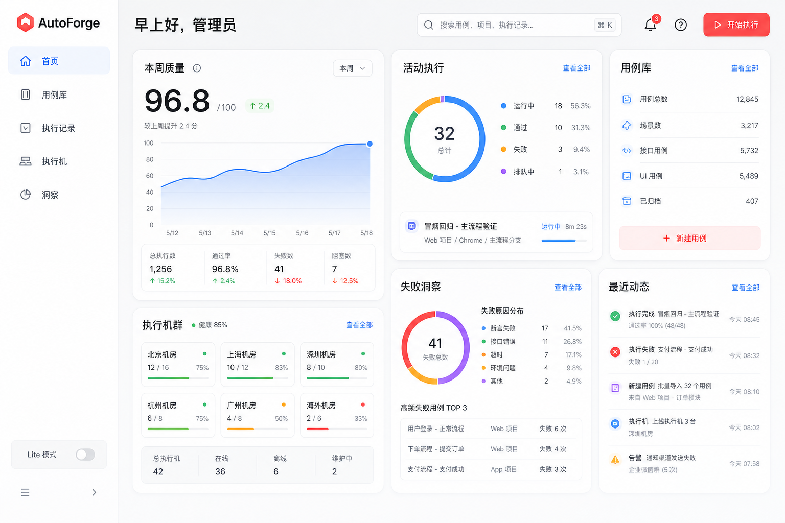
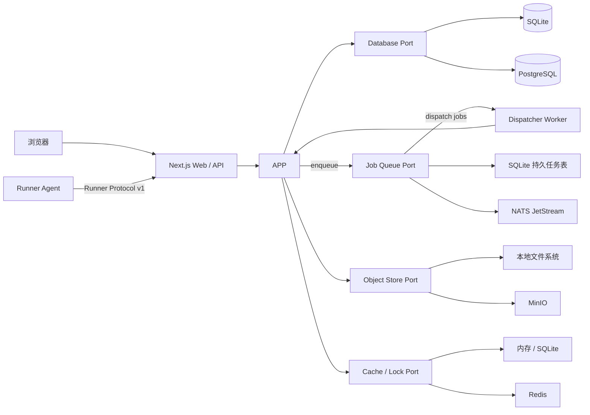

# AutoForge

AutoForge 是一个面向自动化测试场景的用例工厂，用于统一管理用例任务、执行单个或批量用例、管理执行机，并对执行结果进行检索、聚合和分析。主平台内置双架构 Runner Agent；管理员在执行机页面配置 SSH 连接并确认主机指纹后即可自动安装，由 Agent 领取任务、以受控子进程执行命令、采集日志和产物，再将结果上报控制面。

项目同时面向两类部署环境：

- **完整模式（Full）**：使用 PostgreSQL、NATS JetStream、MinIO 和 Redis，适合多执行机、较高并发和生产集群。
- **极简模式（Lite）**：仅需 Node.js 和一个可写数据目录；以 SQLite 保存业务数据和持久任务，本地文件系统保存产物，不依赖任何外部基础设施。

> 当前状态：核心功能、工程事项、页面可见性以及 Gate A–D 已完成。M11 的完整 E2E 验收仍按覆盖矩阵逐项补齐，不能用页面访问或模拟 Agent 代替真实边界、失败和恢复证据；正式生产完成仍以基于新语义版本标签和不可变双架构资产执行 Gate E 为准。

完整的实现事项和阶段验收门见 [AutoForge 待办路线图](./docs/project-roadmap.md)。
按里程碑统计的最新实现证据见 [AutoForge 实现进展](./docs/project-status.md)。

## 当前已实现

- Next.js 16.3.0 App Router 主平台，采用已选方案 E 的 Apple-like Bento 工作台。
- 未登录首页提供实时公开统计、平台能力介绍和初始化/登录入口；大盘按可见性有界轮询聚合数据，不公开项目、用户或秘密详情。
- 主平台首次启动自动生成 Lite 持久配置和不同用途的随机秘密；平台设置页管理模式、监听、Full 基础设施、容量和调度阈值，不读取应用配置环境变量。
- 项目下使用可展开的“版本 → 多个测试阶段”树组织新用例；导入必须选择该层级，旧的未归属用例不进入新用例库。用例按 Java 包路径展示为可展开目录树，详情页集中展示执行历史、分析历史、源码、方法与版本，并可按 `case.read` 权限签发永久匿名只读详情链接；公开页不包含源码、执行控制或项目其他数据。指定来源/目标阶段可跨版本继承用例，目标定义和版本历史独立，底层 JAR 对象安全共享。
- 用例管理新增独立“DDT 管理”Tab：动态字段、CaseID/srNum、普通 `data` 表格与 `step1…stepN` 用户旅程、XLSX/XLS/XLSB/CSV/ODS/ZIP 导入、中文文件名与编码、逐文件预检、覆盖/跳过/报错策略、异步进度/取消/恢复、来源与任务 CaseID 导出、字段模板、永久历史、回收站、批量编辑/导出和项目隔离 API 均已接入 Lite/Full 共享核心。重复的用户、LDAP、审计、备份和诊断能力直接复用主平台，不维护第二套事实。详见 [DDT 管理与融合说明](./docs/architecture/ddt-management.md)。
- TestNG JAR 上传、静态检查、按版本/阶段导入和层级内 SHA-256 去重；同一内容寻址对象可安全共享给不同版本/阶段。
- `CaseDefinition`、不可变 `CaseVersion`、测试方法契约及应用用例。
- Drizzle ORM + SQLite/PostgreSQL 持久化，两种方言使用独立版本化迁移；SQLite 启用外键、WAL 与 busy timeout，持久队列在写锁竞争时有界退避，Lite 内嵌工作器会持续自愈而不要求重启服务。
- Lite 本地对象存储和 Full MinIO 对象存储：JAR 按内容摘要保存，页面只浏览 AutoForge 纳管的对象空间。
- JAR 来源列表、持久化扫描预览和唯一权威全量来源设置；同一项目版本/测试阶段重导不同 JAR 时，完整类名相同的用例沿用稳定定义 ID、保留人工元数据和任务关系，替换可执行方法并立即追加指向新来源的不可变版本。来源间目录对比继续展示新增/变化/移除/冲突并确认权威来源，消失用例按保留语义不自动禁用，排队批次继续按已固化版本读取原 JAR。支持归档/恢复与守卫式删除，共享对象只有在最后一个来源删除后才异步回收。生命周期语义见[用例来源生命周期](./docs/architecture/case-sources.md)。
- 用例文件夹支持递归整选、取消和半选状态；选择目标任务后可反向筛出尚未加入的用例，再批量加入。用例任务创建、任务详情以及任务内用例树形新增/批量删除均使用有界分页渲染；任务列表可将全部普通/DDT 成员导出为仅包含完整类路径和用例名称的 XLSX，数据库读取与工作簿写入均采用流式分批。任务不再有 500 个用例的产品上限，Lite/Full 均以分批 SQL 和调度窗口支持 10 万级任务及执行批次；每个任务强制绑定一个有效项目版本，成员只能来自该版本，任务列表、快捷执行、执行记录、洞察和计划视图均跟随顶栏当前版本并显示版本友好名称。任务支持重命名、描述、复制、归档、启停、版本/变更快照与修订号并发冲突保护，执行策略覆盖 Runner/Runner Group、项目版本、Adapter 环境地址、优先级、基础并发度、在指定轮次判断且命中后持续生效的重跑并发、同轮多 Jenkins 环境并行恢复屏障、重试、排队/领取/上传恢复时限、Runner 标签与产物规则并在批次创建前逐项预检。每条 Jenkins 恢复配置可只读测试任务信息和上一构建，不会触发构建；触发后会作为轮次间时间节点展示，并逐流水线记录构建号、实际起止时间与结果。单用例执行时限只读取平台全局配置。
- 项目级任务完成 Webhook 支持 GET 查询参数和 POST JSON 模板，可在独立“回调通知”页面管理并与多个任务绑定；每个端点可用 100 个用例、80% 通过率的预置消息直接测试连通性和模板。Lite/Full 都先按终态事件幂等持久化通知快照，再以有界租约和退避重试发送；接收端失败不会改变任务执行结果，未配置或未绑定时不会产生任何出站请求。详细语义见 [Webhook 完成通知](./docs/architecture/webhook-notifications.md)。
- 用例定义支持展示名、描述、标签与启停编辑，版本历史可查看来源、创建人与变更原因，并允许从旧版本恢复生成新版本而不覆盖历史。用例库支持按 `case.manage` 权限单删和批量删除；删除同步清理任务成员关系，但保留已经物化的执行与分析历史。
- 主导航新增“用例分析”工作台：主页按任务展示当前项目版本中已进入终态的普通用例批次，每个任务可进入独立分析详情；详情只列出该任务 `currentRound` 最后一轮仍执行失败的用例，单用例执行、日志诊断重跑、最后失败再次执行、未结束批次和较早轮次失败均不进入分析范围。候选支持按类路径、用例名称、失败堆栈和认领状态进行服务端排序与筛选，“我的分析”也支持按类路径、名称、堆栈和分析状态稳定排序并切换升降序。认领、单个/批量分析、三选一结论、问题说明、修改证明、问题单和备注由 Lite/Full 数据库持久化，并通过 `caseDefinitionId` 回显到用例管理详情。分析弹窗展示当前用例最近的人工结论；上一条代码问题结论可在确认问题单未闭环且同一根因后继承。重跑通过会优先关联公开日志页发起的成功重跑永久日志，否则要求在分析弹窗任意位置按 `Ctrl+V`（macOS 为 `⌘+V`）粘贴执行通过截图并通过本地或 MinIO 对象存储保存，不提供点击选择文件入口。主页和详情页均可把最终失败清单导出为紧凑且带统一字体、表头和结论配色的 XLSX，已持久化的责任人、结论、根因、证明和备注会自动回填，未认领/未完成项保留为空。候选和个人队列均使用 50 行游标分页，两个 Tab 按需取数并取消过期请求；列表只传输失败摘要前 8,192 字符，完整日志按需读取，Lite/Full 均有 10 万最终失败记录的性能回归门禁。
- Runner Agent 注册、身份凭据落盘、周期心跳、在线/离线判定和执行机控制台；支持凭据轮换（旧凭据有明确失效窗口）、撤销、禁用、排空与注销，注销后活跃租约立即到期回收，撤销或注销后心跳、claim、上报与终端均被拒绝。
- 首页按本周质量、活动执行、用例库、执行机组、失败洞察和最近动态展示真实工作数据；有 `run.create` 权限的用户可在任意页面通过顶栏“开始执行”发起任务或单用例执行。
- 执行机组可按机房、网络区域或能力维护成员。批次创建时将组成员固化为 Runner ID 快照，后续组变更不会改变历史或运行中的批次；任务和单用例都支持直接选择 Runner 或选择执行机组。
- Runner 页面支持通过 SSH 探测 Ubuntu/openSUSE 主机、确认 SHA-256 主机指纹并自动安装平台内置的 `amd64`/`arm64` 静态 Agent 与 CoTest Adapter。远程命令固定使用探测到的 Bash，服务工作目录默认 `/var/lib/autoforge-agent`，安装或重新安装时可显式填写名称、标签、并发、终端策略、运行账号和绝对数据目录；openSUSE 被报告为 SLES 等无法自动确认的场景可由管理员强制选择安装模式。安装资源前后校验摘要，不调用系统包管理器；成功安装后，SSH 主机、端口、用户名、密码和可选私有 CA 以平台主密钥 AES-256-GCM 加密保存，密码/CA 不回传浏览器。已保存档案重新安装时仍必须先探测并确认配置，并通过绑定原 Runner ID 的短期令牌恢复同一逻辑节点，避免任务和执行机组指向废弃身份；最多 50 台的批量升级只替换 Agent/Adapter 程序，远端配置、systemd unit、身份和数据目录保持原字节不变。短期注册令牌成功使用后仍从 Agent 配置原子清除。Agent 重启恢复按协议上限分批核对本地 attempt，直连终端在恢复扫描前建立，assignment claim 在全部核对完成后启动。
- 顶栏提供全局项目切换，首页、用例、任务、记录、洞察、来源、审计和项目设置共享同一服务端校验上下文。任务快捷执行只提交 `suiteId` 并使用任务保存的完整配置；单用例快捷执行允许临时选择 Runner/Runner Group、重跑和 Adapter 环境地址，并默认启用 CoTest Adapter。任务与单用例均不提供手工参数覆盖；TestNG 发现参数只读固化。产品级执行环境与执行密文页面、API 和任务字段已退役，新批次不再接受这两类配置。
- 批次执行前预检一次返回任务状态、参数、Runner capability/标签、项目版本 Java/TestNG 工具链、权威 JAR 对象和资源限制的逐项 blocker；正式创建复用相同规则，调度、claim 和下载仍执行权威复核。
- 顶栏执行弹窗支持立即执行或最长七天、精确到秒的持久化倒计时。计划开始时间由服务端固化，Lite/Full 在到点前都不会分配用例，排队超时也从到点后开始；执行记录和详情会显示实时倒计时。
- Jenkins Pipeline 插件提供 `autoforgeRun` 与 `autoforgePublishDependencies` 两个步骤：前者使用 API Key 启动任务，按服务端建议周期打印轮次/通过/失败与免登录进展链接，在可配置总时限内等待批次终态，并在完成后输出永久匿名结果链接 `resultUrl`；永久页复用执行历史详情的概览、轮次、图表和用例表格，但不加载产品侧栏或鉴权操作。后者按项目版本替换依赖压缩包链接，不保存历史版本文件，拒绝时会显示服务端可操作错误。两个客户端固定使用 HTTP/1.1，兼容未配置 TLS 代理的 Lite 地址；各插件目录都包含只填写必需参数的 `Jenkinsfile`，ZIP 依赖发布无需重复填写文件名和格式。必填、选填、默认值、权限和网络约束分别见[执行插件参数指南](./integrations/jenkins/autoforge-execution/README.md)与[依赖发布插件参数指南](./integrations/jenkins/autoforge-dependency-publisher/README.md)。两个 HPI、SBOM、校验和与发布清单随 Release 分发，并通过真实 Pipeline DSL E2E 与 HPI 包结构校验。完整流水线见 [`examples/jenkins/Jenkinsfile`](./examples/jenkins/Jenkinsfile)。
- 本地账号首次管理员引导、scrypt 密码、本地/LDAP 统一登录、安全会话、锁定/解锁、密码恢复、六种内置角色和服务端 RBAC；登录来源由服务端根据已有账号来源与 LDAP 启用状态自动判定，同名本地账号优先且目录故障不影响本地紧急管理员。角色、服务账号、项目作用域和 API 令牌权限统一使用带人类友好名称与用途说明的复选框组。自定义角色可创建、编辑、停用与删除（内置角色不可变，引用中角色与最后一位系统管理员受保护，权限变更全量审计并撤销相关会话）；项目支持创建、归档、成员角色分配与负责人转移。批次、日志、Attempt 时间线、产物下载和取消按权威项目过滤，跨项目 ID 猜测不会读取内容。
- LDAP 配置字段与 DDT Insight 保持一致：`enabled`、`url`、服务 Bind、用户 Base/Filter、显示名/邮箱属性、Group 属性或 Group Search、统一默认角色、TLS 证书校验和连接超时。登录先使用服务账号（也可匿名）唯一检索用户 DN，再用同一连接绑定用户密码；平台用户名始终取登录框输入，不依赖额外的用户名映射属性。Group 仅保存到用户资料供查看，既不映射角色也不授予权限；首次建号只分配配置的统一默认角色。TLS 证书校验默认开启，可针对隔离目录显式关闭并持续显示风险提示；Bind 密码使用主密钥加密且不回显。历史 StartTLS、全量同步和 Group 权限映射字段只保留数据库升级兼容，不再通过页面、API 或后台作业执行。
- 用户管理支持 URL 驱动的搜索、来源筛选和游标分页，以及本地账号创建、启停/解锁、密码重置和按用户撤销全部会话；LDAP 管理属性不提供本地编辑入口。
- SQLite/PostgreSQL assignment、lease、状态事件、完成回执、日志水位和产物元数据，以及原子 claim、续租、回收、reconcile、取消、失败重排和批次聚合；冲突完成会保留事件证据，领取/lease/单用例执行超时使用不同稳定结果码。正常执行完毕统一显示“执行完成”，即使仍有用例失败；基础设施异常和中断分别显示“执行异常”“执行中断”。执行详情可按已分配、执行中、通过、失败、超时、取消和未执行筛选用例；单次 attempt 的永久匿名日志页按时间顺序列出同批次、同用例的全部终态轮次，并在当前标签页切换日志。
- 总体与单 Runner 调度日志首次读取最新一页并默认定位末尾，历史事件通过反向游标自动补齐；当前页面内重复打开复用有界 LRU 缓存，新事件按正向游标增量刷新，事件行使用窗口化渲染且不再要求手工“加载更多”。
- Lite/Full 共用持久审计模型，覆盖身份、LDAP、来源/任务、批次/执行取消、Runner 和终端操作；自动重试审计与执行状态事务一致，详情只保留稳定 ID、结果码和计数等脱敏摘要。
- `packages/runner-sdk` 中的 Runner Protocol v1 输入校验、兼容协商和有界长轮询控制器。
- Agent 上报 CPU、内存、1 分钟负载与逻辑 CPU 数；调度阈值集中配置，过载或指标过期的节点不会获得新分配。
- Runner 页面以紧凑行展示状态、Agent/协议、Linux 架构、槽位/资源、心跳和生命周期操作，不重复展示主机 JDK/TestNG 与原始 capability。不可变 `ExecutionSpec` 仍固化运行时要求；接受项目运行时资产的 Agent 使用任务下发的权威 JDK/依赖，不因主机探测版本被阻止，旧 Agent 仍校验主机 Java 11+ 与 TestNG 7.11.0。协议、平台和执行能力不兼容仍在批次选择、服务端调度、assignment claim 和 Agent 本地校验四层被阻止。
- 可选的 Agent 直连终端：方案 E 浮窗使用 xterm.js，支持标题栏一键铺满可用视口并还原；登录会话通过独立 `runner.terminal` 权限换取一次性短时票据，再由同源 WebSocket 中继到 Agent 的受控 PTY；请求、开始、结束、断开原因和有界流量摘要进入持久审计，不记录命令内容或终端输出。
- Full 模式按需连接 PostgreSQL、NATS、MinIO、Redis，readiness 实际检查四项依赖；Lite 启动不加载 Full 客户端。
- `/api/v1` 管理接口，以及 liveness/readiness 健康检查。
- TestNG 解析单元测试、SQLite/PostgreSQL/本地对象/MinIO 集成测试和浏览器管理闭环测试；Agent 安全、日志/spool 与产物矩阵覆盖参数注入、越界 cwd、环境泄漏、失效凭据、资源/进程树清理、跨块、交错流、确认缺口、断线重传、重启、配额、脱敏、恶意路径、摘要冲突和对象故障恢复。
- Go 1.26 Runner Agent 的版本信息、配置诊断、受控工作目录、无 Shell 命令执行、日志上限、超时与 Linux 进程组清理。
- Agent 的有界 claim/退避/并发槽位、独立 lease 续租、重启 reconcile、权威测试/依赖 JAR 下载校验、离线工具链 capability，以及按 `methodName+JVM descriptor` 精确选择重载方法的 TestNG 完成上报。控制面使用已认证 claim 携带的实时空闲槽位修正心跳容量滞后，同时始终以数据库中的活跃 reservation 为占用下限；本地 attempt 结束会立即唤醒领取循环，避免继续等待空轮询退避时间。
- CoTest Adapter 的启用状态、Suite、Test 与多个环境地址保存在用例任务中；首轮按稳定用例顺序分散地址，同一用例的后续 attempt 再沿完整环境池轮询，避免重试固定命中同一环境。每个项目版本独立保存上传或 HTTP(S) 链接登记的 JDK/完整 JAR 压缩包，也可显式从同项目其他版本继承共享对象引用，并可分别删除当前版本资源。上传采用流式处理且没有固定业务大小上限，Runner 仍按任务工作区配额校验、下载和安全解压；同一批次在同一 Runner 上只下载一次输入并只解压一次依赖包/JDK，各 attempt 通过批次目录复用 `test-jars`，Agent 重启后仍保留未终态批次的已校验运行时。完成响应、heartbeat 或 claim 确认该批次不再可能派发到本机后才回收。每个用例仍在独立进程和独立子优先 ClassLoader 中执行，主用例 JAR 固定处于 classpath 首位。
- Agent stdout/stderr/诊断流的 UTF-8 分块、精确的双层秘密脱敏、有界异步磁盘 spool、连续确认水位和断线重传；子进程输出与 spool 持久化解耦，不同 attempt 不再共用全局落盘锁，已有 sink 时不保留第二份完整内存日志，普通 Java 类路径不会被误判为 JWT 或因固定尾部缓冲而延迟显示。执行期间每 500 ms 尝试上传新增块，控制面先持久化，再由 Lite 进程内通道或 Full NATS 跨副本广播通过同源、短时票据 WebSocket 推送到执行详情。
- 产物安全发现、SHA-256 声明和鉴权下载；Lite 经控制面流式写入本地对象目录，Full 使用 15 分钟单对象 MinIO 预签名目标，Agent 不持有长期凭据，finalize 前由控制面重新核对大小和 SHA-256。TestNG XML 以禁用 DTD/实体的有界流式解析器提取 suite/test/class/method、耗时和汇总，结果由 SQLite/PostgreSQL 持久化并在执行详情展示，原始 XML 保留为产物。
- SQLite 持久任务和 Lite 嵌入式 worker；PostgreSQL transactional outbox、JetStream 显式确认和 Full 独立 worker。SQLite 队列使用短写事务与 `SQLITE_BUSY`/`SQLITE_LOCKED` 退避，持续锁竞争解除后内嵌 worker 自动恢复。系统诊断会显示死信类型、关联对象与最后错误，管理员确认故障已修复后可重新投递；SQLite/JetStream 运行同一套至少一次投递契约测试，覆盖去重、延迟、租约恢复、死信、重投和关闭排空。
- 管理员存储空间页汇总平台实际占用与内容逻辑大小，并按数据目录、对象存储和外部引用直接生成可折叠目录树，不再暴露分页控件；后台使用有界游标批次自动续读，单个目录按需展开，避免大量文件一次性渲染。目录覆盖全部常规文件、Lite/Full 每批次日志 SQLite、Lite 受管对象、Full MinIO 对象及 URL 型 JDK/依赖引用；展开文件可查看逻辑路径、物理位置、大小和磁盘块占用。
- 可重建的 Lite 内存缓存与 Full Redis 缓存适配器；缓存不作为业务事实来源。
- GitHub Actions CI，以及四变体后端离线镜像和独立发布后 Gate E 检查流水线；耗时验收按独立状态分区并行执行，单个测试 Job 以五分钟内完成为目标。每个后端镜像均内置 Linux `amd64`/`arm64` Agent 与 Adapter。Release 不再构建 `toolchain-amd64/arm64`，JDK 和测试依赖由项目上传或登记内网链接。

平台数据盘提供分级容量告警；Runner spool、工作目录和单项上传有严格上限。普通文件系统无法为整个工作目录提供无瞬时窗口的总量隔离，生产部署仍须按文档使用专用文件系统/项目配额；Full 对象存储总容量由 MinIO/S3 部署侧硬配额负责。Full 的调度消息使用 PostgreSQL outbox 与 JetStream，Redis 只承载可重建缓存和限流语义。

## TestNG JAR 用例发现

导入过程只读取 JAR 的 ZIP 目录和 JVM class 文件，不通过 class loader 加载或执行用户字节码。首版识别 `org.testng.annotations.Test` 与 `Ignore` 的运行时注解：方法级 `@Test` 直接形成测试方法；类级 `@Test` 将类中的 public 方法视为测试方法。`groups`、`enabled`、`description`、`dataProvider`、依赖组/方法与 `priority` 会写入版本快照。根目录 `testng.xml` 的 suite/test 参数、include/exclude 组、package 与类/方法选择规则会参与发现；JAR 内父类的 TestNG 注解继承会被解析，JAR 外父类、`@Factory`/DataProvider 动态语义、嵌套 `testng.xml` 与 suite-files 引用产生有界用户可见警告；Multi-Release JAR 按目标 Java 版本选择 `META-INF/versions` class，未声明 `Multi-Release: true` 的版本化条目按 JVM 语义忽略并提示。

映射规则为：一个项目版本/测试阶段内，一个 TestNG 完整类名对应一个稳定 `CaseDefinition`；首次导入产生 v1，后续不同 JAR 中的同类快照直接覆盖当前可执行内容并追加不可变 `CaseVersion`，不会再创建第二个同名用例。每个版本固化实际 JAR 来源，重载方法通过 JVM descriptor 区分。发现器不限制 JAR 条目数或发现的测试类数量；仍限制 JAR 上传大小、解压总量和单个 class 大小。SHA-256 导入幂等以项目、版本和阶段为边界；不同层级可引用同一个内容寻址 JAR 对象，数据库目录和对象目录应作为同一备份集合。

当前扫描边界：

- 只解析字节码注解，不推断工厂、监听器或运行时动态生成的测试。
- 解析根目录 `testng.xml` 的 suite/test 参数、组、package、class 与 method 选择规则；嵌套 suite 文件和 `suite-files` 引用只产生有界警告，不递归展开。
- 解析 JAR 内父类的可静态确定继承测试；JAR 外部父类保持显式警告。声明 `Multi-Release: true` 的 JAR 按目标 Java 版本选择最高兼容 class，未声明的版本化条目按 JVM 语义忽略并提示。
- 执行快照必须包含一个权威测试 JAR，可附带最多 127 个权威依赖 JAR。有效 lease 的 Runner 只能经控制面下载快照声明的输入；控制面核对权威对象元数据，Agent 再校验总大小、相对 `.jar` 路径、可用空间和 SHA-256。类级执行直接使用 TestNG CLI，方法级执行使用离线内嵌 launcher 按 `methodName+JVM descriptor` 精确匹配 reflection 方法并注入有界参数。

当前 HTTP 接口：

| 方法           | 路径                                                           | 说明                                                 |
| -------------- | -------------------------------------------------------------- | ---------------------------------------------------- |
| `POST`         | `/api/v1/case-sources/jar/inspect`                             | 上传 `multipart/form-data` 的 `file`，只扫描不持久化 |
| `POST`         | `/api/v1/case-sources/jar/import`                              | 扫描、内容寻址保存并事务性导入用例                   |
| `GET`          | `/api/v1/case-definitions`                                     | 游标分页查询用例，可使用 `query`、`cursor`、`limit`  |
| `DELETE`       | `/api/v1/case-definitions`                                     | 批量删除有管理权限的用例                             |
| `DELETE`       | `/api/v1/case-definitions/{caseDefinitionId}`                  | 删除单个有管理权限的用例                             |
| `POST`         | `/api/v1/case-definitions/{caseDefinitionId}/share`            | 生成永久匿名用例详情只读链接                         |
| `GET`          | `/api/v1/case-sources`                                         | 查询 JAR 来源及权威全量来源状态                      |
| `GET`          | `/api/v1/case-sources/{sourceId}`                              | 读取已持久化的 JAR 扫描结果                          |
| `PUT`          | `/api/v1/case-sources/{sourceId}/authoritative`                | 将一个 JAR 设为唯一权威全量来源                      |
| `GET`          | `/api/v1/objects`                                              | 浏览本地对象目录或 MinIO bucket 中的受管对象         |
| `GET`          | `/api/v1/settings/storage`                                     | 游标分批读取平台文件、SQLite 与对象存储空间清单      |
| `GET`          | `/api/v1/failure-analysis/batches`                             | 分页查询含最终失败用例的执行记录                     |
| `GET`          | `/api/v1/failure-analysis/candidates`                          | 筛选和排序一次执行的最终失败用例                     |
| `GET`          | `/api/v1/failure-analysis/history`                             | 批量读取所选用例最近的已完成人工分析结论             |
| `GET/POST`     | `/api/v1/failure-analysis/claims`                              | 查询个人分析队列或批量认领失败用例                   |
| `POST`         | `/api/v1/failure-analysis/claims/{analysisId}/start`           | 选择三种失败类别之一并开始分析                       |
| `POST`         | `/api/v1/failure-analysis/claims/complete`                     | 校验并完成一个或多个失败用例分析                     |
| `POST`         | `/api/v1/failure-analysis/claims/evidence`                     | 为一个或多个分析任务上传重跑通过截图                 |
| `GET`          | `/api/v1/failure-analysis/claims/{analysisId}/evidence`        | 读取有权限查看的分析证明截图                         |
| `GET`          | `/api/v1/case-definitions/{caseDefinitionId}/failure-analyses` | 分页读取一个用例的全部人工分析结论                   |
| `POST`         | `/api/v1/case-suites`                                          | 创建用例任务                                         |
| `GET`          | `/api/v1/case-suites/{suiteId}`                                | 查询用例任务及其用例                                 |
| `POST`         | `/api/v1/case-suites/{suiteId}/cases`                          | 批量添加勾选用例                                     |
| `POST`         | `/api/v1/case-suites/{suiteId}/cases/missing`                  | 从候选集合反向筛选尚未加入任务的用例                 |
| `DELETE`       | `/api/v1/case-suites/{suiteId}/cases/{caseDefinitionId}`       | 删除任务内用例                                       |
| `GET/POST/...` | `/api/v1/ddt/**`                                               | 版本/阶段隔离的 DDT 用例、导入、模板、历史与回收站   |
| `GET/PUT`      | `/api/v1/case-suites/{suiteId}/webhooks`                       | 查询或替换任务绑定的完成通知端点                     |
| `GET/POST`     | `/api/v1/webhooks`                                             | 查询或创建当前项目的 Webhook                         |
| `PATCH/DELETE` | `/api/v1/webhooks/{webhookId}`                                 | 按修订号编辑或删除 Webhook                           |
| `POST`         | `/api/v1/webhooks/{webhookId}/test`                            | 使用预置 80% 通过率消息测试端点                      |
| `GET`          | `/api/v1/webhook-deliveries`                                   | 有界查询项目最近投递结果                             |
| `POST`         | `/api/v1/runner-agents/register`                               | 使用 bootstrap token 注册 Agent                      |
| `POST`         | `/api/v1/runner-agents/{runnerId}/heartbeat`                   | Agent 认证心跳与容量上报                             |
| `GET`          | `/api/v1/runners`                                              | 查询执行机及在线状态                                 |
| `GET`          | `/api/v1/runners/installations/profiles`                       | 查询已保存 SSH 连接的无密码摘要                      |
| `POST`         | `/api/v1/runners/updates`                                      | 使用加密连接档案有界批量更新 Agent                   |
| `GET`          | `/api/v1/runner-groups`                                        | 查询执行机组及成员                                   |
| `POST`         | `/api/v1/runner-groups`                                        | 创建执行机组                                         |
| `GET`          | `/api/v1/runner-groups/{groupId}`                              | 查询单个执行机组                                     |
| `PATCH`        | `/api/v1/runner-groups/{groupId}`                              | 按修订号更新执行机组                                 |
| `DELETE`       | `/api/v1/runner-groups/{groupId}`                              | 删除执行机组（不改变历史批次快照）                   |
| `GET`          | `/api/v1/run-batches`                                          | 查询批跑调度记录                                     |
| `POST`         | `/api/v1/run-batches`                                          | 创建批次并尝试资源感知分配                           |
| `POST`         | `/api/v1/run-batches/preflight`                                | 返回创建前逐项配置阻塞原因                           |
| `GET`          | `/api/v1/run-batches/{batchId}`                                | 查询批次、ExecutionRun 与 RunAttempt                 |
| `GET`          | `/api/v1/run-batches/{batchId}/progress`                       | API Key 或批次签名参数读取 Jenkins 进展摘要          |
| `POST`         | `/api/v1/run-batches/{batchId}/share`                          | 为任意状态批次生成永久匿名只读链接                   |
| `POST`         | `/api/v1/run-batches/{batchId}/terminate`                      | 终止批次调度，在途用例自然完成后关闭任务             |
| `POST`         | `/api/v1/run-batches/{batchId}/cancel`                         | 兼容旧客户端的批次终止别名                           |
| `POST`         | `/api/v1/jenkins/runs`                                         | API Key 启动批次并返回临时进展与永久结果链接         |
| `POST`         | `/api/v1/jenkins/dependencies`                                 | API Key 按项目版本替换依赖压缩包链接                 |
| `POST`         | `/api/v1/runner-agents/{runnerId}/claims`                      | 认证长轮询并原子领取 assignment                      |
| `POST`         | `/api/v1/runner-agents/{runnerId}/leases/{leaseId}/renew`      | 续租并获取取消/排空指令                              |
| `POST`         | `/api/v1/runner-agents/{runnerId}/reconcile`                   | Agent 重启后的 attempt 恢复协商                      |
| `POST`         | `/api/v1/run-attempts/{attemptId}/complete`                    | 幂等完成上报与失败重排                               |
| `GET`          | `/api/v1/run-attempts/{attemptId}/events`                      | 有界游标查询 claim、完成、取消和超时事件             |
| `GET`          | `/api/v1/run-attempts/{attemptId}/logs`                        | 分页查询 stdout、stderr 或 Agent 日志                |
| `GET`          | `/api/v1/run-attempts/{attemptId}/artifacts`                   | 查询执行产物及受控下载入口                           |
| `POST`         | `/api/v1/terminal-sessions`                                    | 登录用户按 RBAC 换取一次性 WebSocket 会话票据        |
| `WS`           | `/api/v1/terminal-stream`                                      | 中继浏览器终端与 Agent 主动建立的终端通道            |
| `GET`          | `/api/v1/health/live`                                          | 进程存活检查                                         |
| `GET`          | `/api/v1/health/ready`                                         | 检查当前模式要求的数据库、对象存储及 Full 服务       |

## 批跑动态调度

顶栏“开始执行”弹窗的任务模式只需选择任务并确认，Runner/Runner Group、项目版本、重跑和 Adapter 地址全部继承任务配置；单用例模式才展示临时执行配置。`/run-batches` 规划路由只重定向到执行记录。每个启用用例固化为一个 `ExecutionRun`；10 万级批次创建时分批写入，调度每轮只读取最多 4,096 个待执行用例，并在后续心跳和完成上报时持续补充。平台只在任务保存的 Runner 快照内，根据在线状态、资源快照新鲜度、空闲并发槽位、CPU、内存和 1 分钟单位 CPU 负载进行准入与评分。首次 attempt 使用资源评分分散负载；同一用例重试时从上一次节点的下一个稳定 Runner ID 开始轮询，跳过不健康、无容量或不兼容节点，只有没有替代节点时才复用。立即重跑模式允许失败用例在同批其他首轮用例仍运行时进入下一次 attempt，整轮轮次模式则按用户选择等待本轮结束；动态并发规则按列表推进，每条规则只在指定轮次判断，命中后从本轮起持续生效，只有后续规则在自己的指定轮次命中才切换。每轮实际并发数随批次固化并在轮次表展示，规则切换同时记入总体调度日志。轮次边界可 Rebuild 指定 Jenkins 任务的上一次流水线，精确跟踪该 Rebuild 成功并等待配置分钟数后再释放下一轮；Jenkins 明确失败属于调度异常，瞬时状态查询故障会有界退避重试。API Token 使用平台主密钥独立加密，不进入任务 JSON、版本快照、日志或浏览器响应。排队、领取和上传收尾使用任务快照中的持久化 UTC deadline；整轮等待与 Jenkins 恢复暂停排队计时，下一轮释放及其他重排从重新可调度时刻获得新的排队窗口。执行期限统一来自平台的单用例执行时限，服务重启后由同一恢复扫描继续裁决。

Runner/传输基础设施失败使用独立的最多两次自动重调度预算，不占用用例失败重跑额度，并且不等待整轮结束。重调度优先避开已对该用例产生异常的 Runner，没有替代节点时才有界回退；每次异常都写入调度事件，执行详情可按执行机、错误和用例聚合查看。“总结”虚拟轮次每个初始用例只保留一行：任一轮通过即计入最终通过，从未通过则保留最后一次失败结果。

终态批次可以仅将最终失败/超时用例复制为一个新批次，单独设置本次并发数，并选择是否继承动态并发与 Jenkins 环境恢复。用例日志弹窗和永久公开日志页都提供“执行此用例”，可从原批次快照发起单用例诊断重跑；连续提交时会沿同一原始用例族上一次实际使用的 Runner 和 Adapter 环境继续轮询，不会因隐藏批次生成新 runId 而回到固定节点或环境池首项。调度产生 attempt 后，原日志弹窗自动出现“查看实时日志”，永久日志详情的执行历史也会立即展示“手动重跑 · 执行中”，已登录的日志读取用户可在当前页面打开实时流。公开页仅允许已登录且拥有对应项目日志读取和执行创建权限的用户发起执行。这类诊断批次不进入执行历史、统计、分析或通知，仅在同一公开日志的“执行历史”中展示状态、结果和发起用户。

执行记录列表和批次详情都提供“终止任务”。请求一经持久化，调度器立即停止创建或下发新
assignment，未领取用例直接关闭；持有有效 lease 的在途用例继续续租并自然完成，不会被强杀，
且不再产生重跑。所有在途用例结束或被超时恢复后，批次终态为 `cancelled`，界面显示“已终止”。

Lite 自托管服务把补调度、assignment 领取/续租/完成、恢复扫描和日志文件写入分派到有界
worker-thread lane；相同 Runner、attempt 或日志批次稳定落到同一 lane，高频补调度请求会合并。
SQLite WAL 和短事务仍是权威并发边界，Web 主线程主要负责鉴权、页面查询与响应映射。16U 基线
使用 25 台、每台 20 槽的合成 Runner，在一次有界窗口内完成 500 个 assignment 的原子预留。

`scheduled` 表示 assignment 已持久化但尚未领取，`running` 表示 Agent 已取得有效 lease。Agent 已接入 claim、续租、取消、reconcile、日志/产物上传和完成上报；执行详情页可分页读取三类日志、下载已上传产物并查看 Attempt 状态时间线。精确评分、并发防超卖、双模式语义和失败重跑边界见[批跑动态调度设计](./docs/architecture/run-scheduling.md)。

## 核心目标

- 集中管理自动化用例、版本、标签、参数和执行策略。
- 支持单个执行、批量执行、失败重试、取消、超时和结果追踪。
- 管理本机或远程执行机的注册、心跳、能力、标签、容量和状态。
- 提供可离线安装的 Runner Agent，以受控命令、环境和工作目录执行用例。
- 保存日志、报告、截图、录像等执行产物，并提供趋势与失败分析。
- 完整模式支持水平扩展，执行任务采用至少一次投递和幂等消费。
- 在无公网环境中完成安装、升级、运行、备份和恢复。
- 保证极简模式是长期受支持的产品形态，而不是仅用于演示的降级版本。

## 目标功能范围

### 用例与任务管理

- 用例定义、版本、标签、分组和启停状态。
- Runner/Runner Group、项目版本、Adapter 地址与执行前校验。
- 单个或批量创建执行任务。
- 优先级、并发度、重试、恢复时限和取消策略；单用例执行时限由平台统一配置。
- 执行时固化用例版本与参数快照，避免后续编辑影响历史结果。

### 执行管理

- 本地执行与远程执行机调度。
- 按执行机标签、能力和可用容量匹配任务。
- 心跳、失联检测、租约续期与任务回收。
- 日志流、阶段进度、结构化结果和执行产物上传。
- 至少一次执行语义；依靠幂等键和状态机处理重复交付。

### 执行机管理

- 执行机注册、认证、禁用和注销。
- 操作系统、架构、运行器版本及自定义能力上报。
- 在线状态、当前负载、最近心跳和任务历史。
- 执行机分组、标签选择和并发上限。
- Runner Agent 领取任务、续租、响应取消并清理子进程树。
- stdout/stderr 有序采集、秘密脱敏、断线落盘和恢复重传。
- 按白名单规则收集报告、截图等产物，并校验数量、大小和 SHA-256。

### 分析与可观测性

- 成功率、失败率、耗时分位数和趋势分析。
- 按项目、用例、标签、执行机、时间范围和失败类型筛选。
- 批次对比、失败聚类，以及按指定任务和起止时间识别不稳定用例。
- 任务审计、状态变更历史和可关联的结构化日志。

## 前端设计方向

AutoForge 已选择方案 E 作为视觉基线：Apple-like 的轻盈桌面 Web 应用、Bento 式信息分组、柔和层次和高可读性。这里的 Apple-like 仅表示视觉语言方向，不复制 Apple Logo、专有图标或产品资产。



颜色 token、页面框架、核心组件、响应式策略、可访问性和实施顺序见[前端设计方案](./docs/design/frontend-design.md)。概念图不是页面背景或像素级实现稿，实际页面必须使用真实组件和业务状态。

## 双模式架构

两种模式共享领域模型、应用服务、API 和前端页面，只替换基础设施适配器。业务代码不得通过判断部署模式形成两套实现。

| 能力             | Lite                                         | Full                           |
| ---------------- | -------------------------------------------- | ------------------------------ |
| Web/API          | 单个 Next.js 进程                            | 一个或多个 Next.js 实例        |
| 后台任务         | 进程内工作器 + SQLite 持久队列               | 独立工作器 + NATS JetStream    |
| 业务数据库       | SQLite                                       | PostgreSQL                     |
| 产物存储         | 本地文件系统                                 | MinIO（S3 API）                |
| 缓存/限流/短租约 | 进程内存或 SQLite                            | Redis                          |
| Runner Agent     | 同发布包本地伴随进程；也可连接少量远程 Agent | 独立部署多个 Agent             |
| 执行机规模       | 单机或少量低并发执行机                       | 多执行机、水平扩展             |
| 外部服务依赖     | 无                                           | PostgreSQL、NATS、MinIO、Redis |



### Lite 模式（目标形态）

Lite 是默认开发模式，也是低资源环境的正式部署模式：

- 单个发布包包含 Web/API 和进程内任务工作器。
- 本地 Runner Agent 由同一发布包作为伴随进程启动，也可以让少量远程 Agent 通过控制面接入。
- SQLite 使用 WAL、busy timeout 和短事务；部署时只允许一个应用写入节点。
- 调度任务存入 SQLite 队列表；工作器消费后持久化 assignment，Runner Agent 再通过执行租约领取；进程异常退出后可回收过期任务或租约。
- 产物写入 `--data-dir` 指定目录下的项目作用域对象路径，数据库只保存元数据和内容校验值。
- 缓存不参与正确性判断；进程重启后允许丢失并自动重建。
- 启动路径不得导入、连接或探测 PostgreSQL、NATS、MinIO、Redis。

Lite 不承诺多应用实例横向扩展。需要多实例或大量执行机时，应迁移到 Full。

### Full 模式

Full 面向生产和集群环境：

- PostgreSQL 已保存当前用例资产、用例任务和 Runner 状态，使用独立迁移历史。
- MinIO 已保存和浏览 JAR 对象，接口语义与 Lite 本地对象存储一致。
- 创建批次时在同一 PostgreSQL 事务写入 outbox；独立 worker 幂等发布到 JetStream，持久化 assignment 后确认消息。
- Redis 实现命名空间、租户和 schema 版本隔离的可重建缓存，并承载 Runner 请求限速；执行事实始终保存在 PostgreSQL。

MinIO 上游仓库已于 2026 年 4 月归档。AutoForge 继续通过标准 S3 兼容接口支持用户指定的 MinIO 方案，但生产部署必须锁定已验证版本和摘要，并单独评估安全维护、升级来源与替代发行版。

### Runner Agent 与控制面协议

配置 cgroup 根且 doctor 验证 `cpu`、`memory`、`pids` controller 的真实委派和子 cgroup 写权限后，Runner 上报 `isolation:cgroup-v2`。每个 attempt 在用户 Java 启动前进入独立 cgroup，CPU 使用 `cpu.max`、内存使用 `memory.max` 且禁用 swap、任务数使用 `pids.max`；包装进程同时设置 `RLIMIT_FSIZE`、`RLIMIT_NOFILE` 并禁用 core dump。未启用 cgroup v2 时，Agent 仍使用 rlimit、进程组、超时和工作区扫描，但不能硬性限制整个进程树的 CPU、内存和进程数，因此只适合受控执行机。工作目录总字节数和条目数每 100ms 扫描；普通目录的扫描无法阻止两次采样间的瞬时超写，需要严格磁盘容量隔离时还必须配置专用文件系统或项目配额。

Runner Agent 是安装在执行机上的 Go 守护进程。`start` 会通过 bootstrap token 注册、以 `0600` 权限保存身份和在途 attempt，发送 Linux CPU、内存和负载快照，并运行有界 assignment claim 与独立 lease 续租循环。Agent 只在离线 Java/TestNG 工具链配置完整时上报精确版本 capability；领取后经控制面下载一个权威测试 JAR 和有界依赖 JAR 集，逐项校验路径、大小与 SHA-256，并在传输前校验总磁盘限制和可用空间，再在独立工作目录中以确定性 classpath 参数调用 Java，不经过 Shell。启动时先 reconcile 本地状态，未获服务端决定不会自行重跑。日志先进入有界异步队列，再在写入有配额的本地 spool 前执行精确脱敏；控制面再次脱敏并只确认连续序号。spool 用于网络中断与 Agent 重启恢复，不位于 Java 输出的同步持久化链路；产物在工作目录内发现、校验和上传。

最终协议仍坚持 Agent 只主动连接 AutoForge 控制面，不直接访问业务数据库、NATS、Redis，也不持有 MinIO 长期凭据，因此同一个 Agent 将连接 Lite 或 Full。

一次执行的基本流程：

```text
claim -> prepare -> start -> stream logs -> collect artifacts -> report result -> cleanup
                 |                    |
                 -> cancel/timeout ---+
```

- 通过一次性 bootstrap token 注册，之后使用可撤销、可轮换的 Runner 身份。
- 使用有界长轮询领取 assignment，通过独立 lease 续期并获取取消/排空指令。
- 命令使用 `executable + args[]` 表示，默认 `shell: false`；复杂脚本作为带摘要的输入文件下发。
- 每次 attempt 使用独立工作目录，限制 cwd、环境变量、执行时间、日志和产物大小。
- stdout/stderr 分流并按序号批量上报，断线时写入有界本地 spool，恢复后从确认水位重传。
- 产物先校验路径、符号链接、大小、数量和 SHA-256，再写入共享配额的原子 spool 并通过受控上传目标提交；重启 reconcile 会先续传未确认产物，再重用原 completion ID 完成上报。
- 心跳只表示 Agent 活性，lease 才代表某次 attempt 的有效执行权。
- Agent 重启后必须先与控制面 reconcile，不得自行重跑未确认任务。

完整的组件、协议草案、安全模型、日志语义和测试要求见 [Runner Agent 架构设计](./docs/architecture/runner-agent.md)。

### 能力端口

核心应用仅依赖下列端口，不直接依赖具体 SDK：

```ts
interface DatabasePort {}
interface JobQueuePort {}
interface ObjectStorePort {}
interface CachePort {}
interface LeasePort {}
interface RunnerControlPort {}
```

端口的真实接口会随领域建模细化。首要约束是：PostgreSQL、NATS、MinIO、Redis 或 SQLite 的客户端类型不得泄漏到领域层和应用层。

## 任务状态与交付语义

建议的执行状态机：

```text
queued -> dispatching -> running -> succeeded
   |          |             |  \-> failed
   |          |             \----> timed_out
   |          \------------------> queued（租约过期/可重试）
   \------------------------------> cancelled
```

- 状态只能通过领域服务执行合法迁移。
- 每次投递携带稳定的 `runId`、`attempt` 和幂等键。
- 每个异步阶段必须先持久化其结果，再确认对应队列消息；调度消息在 assignment 持久化后确认，不跨越整个远程执行周期。
- Agent 领取后的执行权由 lease 管理；完成结果持久化后才向 Agent 确认完成上报。
- 重复结果不得重复计数、重复生成分析数据或覆盖已确认的终态。
- 取消是协作式操作；执行机必须定期检查取消信号并终止子进程。

## 技术基线

| 类别         | 选择                                                                   |
| ------------ | ---------------------------------------------------------------------- |
| 运行时       | Node.js 24 LTS，约束为 `>=24 <25`                                      |
| 主平台       | Next.js 16 App Router + React + TypeScript strict                      |
| Runner Agent | Go 1.26.x；发布工具链固定为 Go 1.26.5；使用 HTTP(S) Runner Protocol v1 |
| 包管理       | pnpm workspace，提交唯一锁文件                                         |
| 数据访问     | Drizzle ORM；PostgreSQL 与 SQLite 使用独立驱动和迁移                   |
| 消息         | NATS JetStream                                                         |
| 对象存储     | MinIO / 本地文件系统适配器                                             |
| 缓存         | Redis / 进程内存与 SQLite 适配器                                       |
| 校验         | Zod（持久配置、API 输入和消息载荷）                                    |
| 测试         | Vitest + Playwright + Go test + 双模式集成测试                         |

截至 2026-08-11，当前实现使用 Node.js 24 LTS 与 Next.js 16.3.0。实际依赖均在 `package.json` 中锁定具体版本，并以 `pnpm-lock.yaml` 为准；不得在可复现构建中使用浮动的 `latest` 标签。

## 仓库结构

```text
autoforge/
├── apps/
│   ├── web/                    # Next.js 页面、Route Handlers、Server Actions
│   ├── worker/                 # Full 独立工作器；Lite 可由 Web 进程嵌入
│   └── runner-agent/           # 执行机守护进程、命令执行、日志与产物采集
├── adapters/
│   └── cotest-testng/          # 自备 JDK/JAR 的独立 CoTest TestNG 执行适配器
├── integrations/jenkins/       # 任务执行与版本依赖推送 Pipeline 插件
├── packages/
│   ├── domain/                 # 实体、值对象、状态机、领域错误
│   ├── application/            # 用例编排和端口定义
│   ├── contracts/              # API、事件、任务载荷及版本
│   ├── testng-discovery/       # JAR 与 JVM class 静态解析
│   ├── db/                     # PostgreSQL/SQLite schema、迁移与仓储适配器
│   ├── queue/                  # JetStream/SQLite 队列适配器
│   ├── object-store/           # MinIO/本地文件系统适配器
│   ├── cache/                  # Redis/内存/SQLite 适配器
│   ├── runner-sdk/             # 执行机协议、认证和心跳客户端
│   ├── executors/              # process/container 执行器及共享安全策略
│   ├── ids/                    # UUIDv7 等应用层标识生成
│   └── platform-config/        # 类型化持久平台配置
├── deploy/compose/             # Full/Lite Compose 与离线环境模板
├── scripts/
│   ├── agent/                  # 无包管理器的内置 Agent 安装脚本
│   ├── operations/             # 备份、恢复、迁移和工具链脚本
│   └── release/                # 内置资源、镜像、清单和签名脚本
├── docs/
│   ├── project-roadmap.md      # 当前待办路线图和阶段验收门
│   ├── architecture/           # 架构说明和 ADR
│   ├── archive/                # 带版本背景的历史审计与决策记录
│   ├── design/                 # UI 设计规范、实现约束和已选视觉资产
│   ├── legal/                  # 可选重分发组件的补充声明
│   ├── operations/             # 部署、升级、备份、恢复和排障
│   └── reference/              # 协议和版本兼容参考
├── tests/
│   ├── e2e/
│   └── performance/
├── AGENTS.md
└── README.md
```

这里只列出当前存在且具有实际行为的主要目录，不为目标结构预建空包。

## 配置约定

AutoForge 不读取 `AUTOFORGE_*` 应用配置环境变量。进程只接受安装级数据目录参数：

```bash
pnpm start -- --data-dir=/var/lib/autoforge
```

首次启动在 `<data-dir>/config` 创建：

- `platform.json`：schema v1 平台配置，权限 `0600`；包含模式、Web、容量、调度、worker、Full 基础设施和随机秘密；
- `initial-admin-token`：权限 `0600` 的首位管理员一次性令牌，管理员创建成功后删除。

没有显式参数时，已存在的 `/var/lib/autoforge` 优先，否则使用当前目录的 `data`。默认配置为 Lite，可在没有 PostgreSQL、NATS、MinIO 或 Redis 的条件下独立启动。管理员通过 `/settings/platform` 管理监听地址、执行机可访问的 HTTP/HTTPS 地址、平台时区、Lite/Full 模式、Full 连接信息、容量与调度阈值；秘密字段只写不回显。平台时区使用 IANA 名称，默认 `Asia/Shanghai`（东八区），统一控制 Web 页面、匿名分享页、时间筛选和质量趋势的自然日边界；任务 Cron 仍可保存自己的时区。配置采用 revision 条件和原子替换：平台时区、外部访问地址及产物收集保存后立即生效，产物开关只影响新批次并固化进批次快照；监听端口、基础设施、容量、调度与 worker 参数保存后会明确提示需要重启。HTTP/IP 直连仅适用于可信内网，跨不可信网络应使用 HTTPS。

Runner Agent 由主平台自动生成独立 JSON 配置并以 `--config /etc/autoforge-agent/config.json` 启动，不复用服务端数据库或基础设施凭据。自动安装支持已有 SSH、Bash、systemd 和基础系统命令的 Ubuntu/openSUSE；cgroup v2 可用时自动启用，缺失时使用降级隔离。服务默认使用专用非特权账号，管理员也可显式选择 root 模式；安装过程不会联网或调用系统包管理器。JDK/TestNG 与业务依赖可由项目上传或登记 Runner 可访问的内网链接，也可使用执行机本地预置工具链作为后备。

直连终端不使用 SSH 协议，也不要求执行机开放入站端口：Agent 使用自身身份主动建立 WebSocket，平台只中继当前浮窗的输入输出。配置、反向代理和安全边界见 [Runner 直连终端](./docs/operations/direct-terminal.md)。

## 离线部署要求

离线交付物应包含：

- 固定版本的 OCI 镜像归档及镜像清单。
- Lite 单体镜像，以及 Full 所需全部服务镜像。
- 内置双架构 Runner Agent、受控安装脚本、资源清单和兼容矩阵。
- Compose 文件、Docker secret 模板、数据库迁移和初始化说明。
- Jenkins 两个 HPI 及各自 SPDX JSON SBOM。
- 安装、升级、回滚、备份、恢复和完整性校验文档。
- SHA-256 校验和、依赖许可证清单和 SBOM。

运行时不得依赖 CDN、远程字体、外部遥测、公共对象存储或在线许可证校验。UI 字体、图标和静态资源必须随发布包提供。离线验收将在禁止出站网络的环境中执行。

## 数据与迁移原则

- PostgreSQL 和 SQLite 的领域语义必须一致，但允许使用独立的方言迁移文件。
- 标识符由应用生成，不依赖数据库自增序列。
- 时间统一以 UTC 存储，API 使用 ISO 8601 表示；页面按后台平台配置的 IANA 时区展示和解析时间输入，默认 `Asia/Shanghai`（UTC+8），悬停详情仍可查看 UTC 原值。
- 禁止让核心查询依赖仅一个数据库支持的特性；确有必要时提供等价实现和双模式测试。
- 批量任务、执行快照、状态历史和产物元数据属于权威数据，必须可备份。
- Lite 升级前备份 SQLite 文件和对象目录；恢复时二者应视为同一个一致性集合。

## 安全边界

自动化用例可能执行不受信任的命令或脚本。执行机实现至少需要：

- 使用参数数组启动子进程，不拼接 Shell 命令。
- 每次运行使用独立工作目录，并限制可访问路径。
- 支持超时、输出大小、并发和资源上限。
- 取消或超时时终止整个子进程树，而不只是直接子进程。
- 对日志中的令牌、密码和密文变量进行脱敏。
- 校验上传对象名，阻止路径穿越和覆盖任意文件。
- 控制面与执行机之间使用短期凭据和可轮换身份。
- Runner Agent 只建立出站连接，不接收数据库、NATS、Redis 或 MinIO 长期凭据。
- 直连终端默认关闭；启用后 Shell 只以 Agent 服务账户运行，并受本机最大会话数、最长时长、固定 Shell、环境变量白名单和进程组清理约束。

容器隔离并不自动等于安全沙箱。执行不可信代码时，应结合专用主机、容器/虚拟机隔离和最小权限策略。

## 里程碑

1. **基础骨架（已完成）**：workspace、Next.js、类型化配置、质量工具和基础 UI。
2. **TestNG 用例资产（已完成首版）**：JAR 静态扫描、SQLite 用例库、本地来源对象和导入 UI。
3. **Lite 执行闭环（已完成首版）**：执行领域、SQLite 队列、Agent 执行、本地产物、日志和基本结果页已接通；资源硬限制与完整 E2E 仍待验收。
4. **Runner 控制面（已完成首版）**：assignment、claim、lease、reconcile、取消、日志、产物、幂等完成、失败重排与批次聚合已落地。
5. **Full 执行适配器（已完成首版）**：PostgreSQL、MinIO、transactional outbox、JetStream、Redis 与独立 worker 已接通；水平扩展和故障注入仍待验收。
6. **分析能力**：趋势、筛选、失败分类、批次对比和数据保留策略。
7. **离线交付（构建流水线已完成）**：继续补齐安装升级、备份恢复和断网端到端验收。

## 开发与运行

主平台开发前置条件为 Node.js `>=24 <25`；完整质量检查还需要 Go 1.26.x。仓库通过 Corepack 固定 pnpm 11.20.0：

```bash
corepack enable
pnpm install --frozen-lockfile
pnpm dev
```

打开 <http://localhost:3000>。默认数据写入仓库根目录的 `data/`；目录已被 Git 忽略。应用配置不从 `.env` 读取：首次启动后在 `/settings/platform` 中设置，或停止服务后编辑所选数据目录下的 `config/platform.json`。

生产构建与启动：

```bash
pnpm build
pnpm start
```

首次访问数据库入口时会按顺序执行当前方言的版本化 SQL 迁移；不会使用 schema push。使用 Compose 部署时，分别从 `deploy/compose/lite/.env.example` 或 `deploy/compose/full/.env.example` 复制对应模板；Full 基础设施连接由平台持久配置管理。当前质量命令为：

```bash
pnpm format:check
pnpm lint
pnpm typecheck
pnpm test
pnpm test:integration
pnpm test:full
pnpm test:deployment
pnpm test:e2e
pnpm build
```

`pnpm test:integration` 无需 Full 外部服务即可运行 SQLite 队列契约；`pnpm test:full` 使用固定版本的真实 NATS JetStream 再运行同一套契约，并同时验证 PostgreSQL、MinIO 和 Redis 组合根。

## Docker Compose 部署

仓库提供两套不会混淆运行边界的单机模板：

- [Lite Compose](./deploy/compose/lite/docker-compose.yml) 只启动 AutoForge，持久化 SQLite 和本地对象目录；
- [Full Compose](./deploy/compose/full/docker-compose.yml) 启动 AutoForge、PostgreSQL、NATS JetStream、MinIO 和 Redis，并通过一次性初始化任务创建对象 bucket。

两套模板都直接使用 Release 中导入的 AutoForge 镜像，并设置 `pull_policy: never`。Full 的基础设施镜像也固定到精确 digest，不会在离线启动时回退到可变 tag 或自动拉取。凭据生成、镜像准备、启动、升级和卷保护步骤见 [Compose 部署说明](./deploy/compose/README.md)。

Playwright 首次运行需要已有 Chromium。联网开发机可按 Playwright 官方方式准备浏览器；离线环境应随测试工具包预置浏览器，并通过 `PLAYWRIGHT_CHROMIUM_EXECUTABLE_PATH` 指向该可执行文件，运行时不会自动下载。

## GitHub Release 与离线包

仓库的 `Release` workflow 由 `vX.Y.Z` tag 触发，立即并行构建 `amd64`、`arm64` 后端镜像，制品完整、签名和清单生成成功后直接发布。标签源码质量检查按静态检查、单元/集成、构建、Full 与断网 Lite 分区并行执行；Release 成功公开后，独立 `Published Release acceptance` workflow 再并行验证签名资产、上一正式版本升级、迁移失败回滚、备份恢复、真实 Agent 和 LDAP。检查失败会保留明确状态，但不会阻塞、取消或撤回已经完成的发布。Release 还包含版本化 Lite/Full Compose 部署包、集中保存各资产 SPDX JSON SBOM 与法律声明的 metadata 包、`SHA256SUMS`、机器可读清单和构建来源证明。

后端镜像使用 Debian/glibc 用户空间；容器不依赖宿主机 libc，因此 Alpine/musl 宿主也只需按 CPU 选择 `amd64` 或 `arm64` 镜像。每个镜像内置两份 `CGO_ENABLED=0` 的 Linux 静态 Agent，并验证其无动态解释器和 libc 依赖，同一架构可在 glibc 或 musl 执行机运行。正式 Release 的离线镜像直接使用 Docker 原生 `.docker.tar`，可通过 `docker load --input` 导入，不要求目标机安装 zstd。Release 发布 AutoForge 自身镜像，不重新分发 PostgreSQL、NATS、MinIO 或 Redis 镜像；xterm.js、WebSocket 和 PTY 库已经固定版本并打入 AutoForge 发布物，不产生运行时下载。

具体资产命名、tag 流程、校验、离线导入和本地构建命令见 [Release 与离线交付](./docs/operations/releases.md)。

## 参考资料

- [Next.js 16](https://nextjs.org/blog/next-16)
- [Next.js App Router](https://nextjs.org/docs/app)
- [Node.js 发布与 LTS 周期](https://nodejs.org/en/about/previous-releases)
- [NATS JetStream](https://docs.nats.io/nats-concepts/jetstream)
- [MinIO 容器部署文档](https://min.io/docs/minio/container/index.html)

## License

AutoForge 源码采用 Apache License 2.0，见根目录 [LICENSE](./LICENSE) 与 [NOTICE](./NOTICE)。第三方组件继续适用各自许可证，精确版本和 SPDX 标识记录在 [THIRD_PARTY_LICENSES.json](./THIRD_PARTY_LICENSES.json)；发布方仍须根据实际打包二进制携带所需许可证文本、归属声明和源代码要约。
