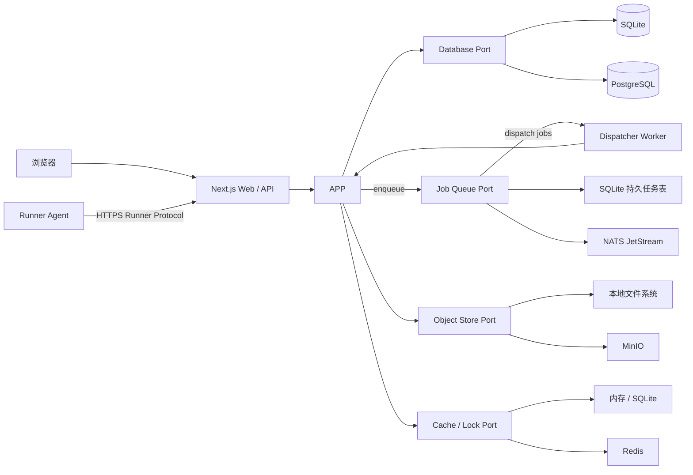

# AutoForge

AutoForge 是一个面向自动化测试场景的用例工厂，用于统一管理用例任务、执行单个或批量用例、管理执行机，并对执行结果进行检索、聚合和分析。执行机安装独立的 Runner Agent，由 Agent 领取任务、以受控子进程执行命令、采集日志和产物，再将结果上报控制面。

项目同时面向两类部署环境：

- **完整模式（Full）**：使用 PostgreSQL、NATS JetStream、MinIO 和 Redis，适合多执行机、较高并发和生产集群。
- **极简模式（Lite）**：仅需 Node.js 和一个可写数据目录；以 SQLite 保存业务数据和持久任务，本地文件系统保存产物，不依赖任何外部基础设施。

> 当前状态：首个可运行的 Lite 里程碑已经落地。现在可以启动主平台、静态扫描 TestNG JAR、预览测试类与方法并导入 SQLite 用例库。Go Runner Agent 已有配置诊断和受控单次命令执行核心，但尚未接入控制面。执行任务闭环、Full 基础设施适配器和分析能力仍处于后续里程碑；以 `AUTOFORGE_MODE=full` 启动会明确失败，不会静默回退 Lite。

## 当前已实现

- Next.js 16.3.0 App Router 主平台，采用已选方案 E 的 Apple-like Bento 工作台。
- TestNG JAR 上传、静态检查、导入和 SHA-256 去重。
- `CaseDefinition`、不可变 `CaseVersion`、测试方法契约及应用用例。
- Drizzle ORM + SQLite 持久化，使用版本化 SQL 迁移并启用外键、WAL 与 busy timeout。
- Lite 本地对象存储：JAR 按内容摘要保存到 `AUTOFORGE_DATA_DIR/objects/jars`。
- 仪表盘、用例库、导入预览、加载/错误/空状态和响应式导航。
- `/api/v1` JAR 与用例接口，以及 liveness/readiness 健康检查。
- TestNG class 解析单元测试、真实 SQLite 集成测试和 JAR 导入浏览器闭环测试。
- Go 1.26 Runner Agent 的版本信息、配置诊断、受控工作目录、无 Shell 命令执行、日志上限、超时与 Linux 进程组清理。
- GitHub Actions CI，以及后端离线镜像和 Agent 四变体 GitHub Release 流水线。

尚未实现：执行批次与任务、SQLite 队列、控制面 Runner Protocol、远程日志/产物收集、鉴权、多租户、PostgreSQL/NATS/MinIO/Redis 适配器及分析页面。当前界面中的这些入口会明确标为“规划中”。Agent 的 `run-once` 仅用于验证执行安全核心，不能冒充平台已能调度 JAR。

## TestNG JAR 用例发现

导入过程只读取 JAR 的 ZIP 目录和 JVM class 文件，不通过 class loader 加载或执行用户字节码。首版识别 `org.testng.annotations.Test` 与 `Ignore` 的运行时注解：方法级 `@Test` 直接形成测试方法；类级 `@Test` 将类中的 public 方法视为测试方法。`groups`、`enabled`、`description`、`dataProvider`、依赖组/方法与 `priority` 会写入版本快照。

映射规则为：一个 TestNG 测试类对应一个 `CaseDefinition`，每次导入形成不可变 `CaseVersion`，重载方法通过 JVM descriptor 区分。整个 JAR 以 SHA-256 去重；数据库目录和本地对象目录应作为同一备份集合。

当前扫描边界：

- 只解析字节码注解，不推断工厂、监听器或运行时动态生成的测试。
- 检测根目录 `testng.xml`，但尚不解析 suite 的 include/exclude、参数或 package 选择规则。
- 尚不解析 JAR 外部父类中的继承测试，也会忽略 `META-INF/versions` 中的多版本 class 并返回扫描警告。
- 导入只建立用例资产；JAR 还不能在 Runner Agent 上执行。

当前 HTTP 接口：

| 方法   | 路径                               | 说明                                                 |
| ------ | ---------------------------------- | ---------------------------------------------------- |
| `POST` | `/api/v1/case-sources/jar/inspect` | 上传 `multipart/form-data` 的 `file`，只扫描不持久化 |
| `POST` | `/api/v1/case-sources/jar/import`  | 扫描、内容寻址保存并事务性导入用例                   |
| `GET`  | `/api/v1/case-definitions`         | 游标分页查询用例，可使用 `query`、`cursor`、`limit`  |
| `GET`  | `/api/v1/health/live`              | 进程存活检查                                         |
| `GET`  | `/api/v1/health/ready`             | Lite 数据目录和 SQLite 就绪检查                      |

## 核心目标

- 集中管理自动化用例、版本、标签、参数和执行策略。
- 支持单个执行、批量执行、失败重试、取消、超时和结果追踪。
- 管理本机或远程执行机的注册、心跳、能力、标签、容量和状态。
- 提供可离线安装的 Runner Agent，以受控命令、环境和工作目录执行用例。
- 保存日志、报告、截图、录像等执行产物，并提供趋势与失败分析。
- 完整模式支持水平扩展，执行任务采用至少一次投递和幂等消费。
- 在无公网环境中完成安装、升级、运行、备份和恢复。
- 保证极简模式是长期受支持的产品形态，而不是仅用于演示的降级版本。

## 目标功能范围

### 用例与任务管理

- 用例定义、版本、标签、分组和启停状态。
- 参数模板、环境变量、密文引用与执行前校验。
- 单个或批量创建执行任务。
- 优先级、并发度、重试、超时和取消策略。
- 执行时固化用例版本与参数快照，避免后续编辑影响历史结果。

### 执行管理

- 本地执行与远程执行机调度。
- 按执行机标签、能力和可用容量匹配任务。
- 心跳、失联检测、租约续期与任务回收。
- 日志流、阶段进度、结构化结果和执行产物上传。
- 至少一次执行语义；依靠幂等键和状态机处理重复交付。

### 执行机管理

- 执行机注册、认证、禁用和注销。
- 操作系统、架构、运行器版本及自定义能力上报。
- 在线状态、当前负载、最近心跳和任务历史。
- 执行机分组、标签选择和并发上限。
- Runner Agent 领取任务、续租、响应取消并清理子进程树。
- stdout/stderr 有序采集、秘密脱敏、断线落盘和恢复重传。
- 按白名单规则收集报告、截图等产物，并校验数量、大小和 SHA-256。

### 分析与可观测性

- 成功率、失败率、耗时分位数和趋势分析。
- 按项目、用例、标签、执行机、时间范围和失败类型筛选。
- 批次对比、失败聚类和不稳定用例识别。
- 任务审计、状态变更历史和可关联的结构化日志。

## 前端设计方向

AutoForge 已选择方案 E 作为视觉基线：Apple-like 的轻盈桌面 Web 应用、Bento 式信息分组、柔和层次和高可读性。这里的 Apple-like 仅表示视觉语言方向，不复制 Apple Logo、专有图标或产品资产。


颜色 token、页面框架、核心组件、响应式策略、可访问性和实施顺序见[前端设计方案](./docs/design/frontend-design.md)。概念图不是页面背景或像素级实现稿，实际页面必须使用真实组件和业务状态。

## 双模式架构

两种模式共享领域模型、应用服务、API 和前端页面，只替换基础设施适配器。业务代码不得通过判断部署模式形成两套实现。

| 能力             | Lite                                         | Full                           |
| ---------------- | -------------------------------------------- | ------------------------------ |
| Web/API          | 单个 Next.js 进程                            | 一个或多个 Next.js 实例        |
| 后台任务         | 进程内工作器 + SQLite 持久队列               | 独立工作器 + NATS JetStream    |
| 业务数据库       | SQLite                                       | PostgreSQL                     |
| 产物存储         | 本地文件系统                                 | MinIO（S3 API）                |
| 缓存/限流/短租约 | 进程内存或 SQLite                            | Redis                          |
| Runner Agent     | 同发布包本地伴随进程；也可连接少量远程 Agent | 独立部署多个 Agent             |
| 执行机规模       | 单机或少量低并发执行机                       | 多执行机、水平扩展             |
| 外部服务依赖     | 无                                           | PostgreSQL、NATS、MinIO、Redis |



### Lite 模式（目标形态）

Lite 是默认开发模式，也是低资源环境的正式部署模式：

- 单个发布包包含 Web/API 和进程内任务工作器。
- 本地 Runner Agent 由同一发布包作为伴随进程启动，也可以让少量远程 Agent 通过控制面接入。
- SQLite 使用 WAL、busy timeout 和短事务；部署时只允许一个应用写入节点。
- 调度任务存入 SQLite 队列表；工作器消费后持久化 assignment，Runner Agent 再通过执行租约领取；进程异常退出后可回收过期任务或租约。
- 产物写入 `AUTOFORGE_DATA_DIR` 下的本地对象目录，数据库只保存元数据和内容校验值。
- 缓存不参与正确性判断；进程重启后允许丢失并自动重建。
- 启动路径不得导入、连接或探测 PostgreSQL、NATS、MinIO、Redis。

Lite 不承诺多应用实例横向扩展。需要多实例或大量执行机时，应迁移到 Full。

### Full 模式（目标形态）

Full 面向生产和集群环境：

- PostgreSQL 保存权威业务状态和分析数据。
- NATS JetStream 持久化执行任务和事件，消费者显式确认，任务可重投。
- MinIO 保存日志归档、报告、截图、录像等大对象。
- Redis 用于缓存、速率限制、短期锁和临时状态，但不作为唯一事实来源。
- Web/API、调度器和工作器可以独立扩容。

### Runner Agent（执行核心已实现，控制协议待实现）

Runner Agent 是安装在执行机上的 Go 守护进程。当前程序可以执行 `version`、`doctor` 和本地 `run-once`：执行规格经过版本化校验，只允许本机白名单中的可执行文件，以参数数组直接启动，不经过 Shell，并限制工作目录、运行时间和日志大小。控制面注册、领取、续租、日志重传和产物上传尚未实现。

最终协议仍坚持 Agent 只主动连接 AutoForge 控制面，不直接访问业务数据库、NATS、Redis，也不持有 MinIO 长期凭据，因此同一个 Agent 将连接 Lite 或 Full。

一次执行的基本流程：

```text
claim -> prepare -> start -> stream logs -> collect artifacts -> report result -> cleanup
                 |                    |
                 -> cancel/timeout ---+
```

- 通过一次性 bootstrap token 注册，之后使用可撤销、可轮换的 Runner 身份。
- 使用有界长轮询领取 assignment，通过独立 lease 续期并获取取消/排空指令。
- 命令使用 `executable + args[]` 表示，默认 `shell: false`；复杂脚本作为带摘要的输入文件下发。
- 每次 attempt 使用独立工作目录，限制 cwd、环境变量、执行时间、日志和产物大小。
- stdout/stderr 分流并按序号批量上报，断线时写入有界本地 spool，恢复后从确认水位重传。
- 产物先校验路径、符号链接、大小、数量和 SHA-256，再通过受控上传目标提交。
- 心跳只表示 Agent 活性，lease 才代表某次 attempt 的有效执行权。
- Agent 重启后必须先与控制面 reconcile，不得自行重跑未确认任务。

完整的组件、协议草案、安全模型、日志语义和测试要求见 [Runner Agent 架构设计](./docs/architecture/runner-agent.md)。

### 能力端口

核心应用仅依赖下列端口，不直接依赖具体 SDK：

```ts
interface DatabasePort {}
interface JobQueuePort {}
interface ObjectStorePort {}
interface CachePort {}
interface LeasePort {}
interface RunnerControlPort {}
```

端口的真实接口会随领域建模细化。首要约束是：PostgreSQL、NATS、MinIO、Redis 或 SQLite 的客户端类型不得泄漏到领域层和应用层。

## 任务状态与交付语义

建议的执行状态机：

```text
queued -> dispatching -> running -> succeeded
   |          |             |  \-> failed
   |          |             \----> timed_out
   |          \------------------> queued（租约过期/可重试）
   \------------------------------> cancelled
```

- 状态只能通过领域服务执行合法迁移。
- 每次投递携带稳定的 `runId`、`attempt` 和幂等键。
- 每个异步阶段必须先持久化其结果，再确认对应队列消息；调度消息在 assignment 持久化后确认，不跨越整个远程执行周期。
- Agent 领取后的执行权由 lease 管理；完成结果持久化后才向 Agent 确认完成上报。
- 重复结果不得重复计数、重复生成分析数据或覆盖已确认的终态。
- 取消是协作式操作；执行机必须定期检查取消信号并终止子进程。

## 技术基线

| 类别         | 选择                                                  |
| ------------ | ----------------------------------------------------- |
| 运行时       | Node.js 24 LTS，约束为 `>=24 <25`                     |
| 主平台       | Next.js 16 App Router + React + TypeScript strict     |
| Runner Agent | Go 1.26.x；发布工具链固定为 Go 1.26.5；未来使用 HTTPS Runner Protocol |
| 包管理       | pnpm workspace，提交唯一锁文件                        |
| 数据访问     | Drizzle ORM；PostgreSQL 与 SQLite 使用独立驱动和迁移  |
| 消息         | NATS JetStream                                        |
| 对象存储     | MinIO / 本地文件系统适配器                            |
| 缓存         | Redis / 进程内存与 SQLite 适配器                      |
| 校验         | Zod（环境变量、API 输入和消息载荷）                   |
| 测试         | Vitest + Playwright + Go test + 双模式集成测试        |

截至 2026-08-09，当前实现使用 Node.js 24 LTS 与 Next.js 16.3.0。实际依赖均在 `package.json` 中锁定具体版本，并以 `pnpm-lock.yaml` 为准；不得在可复现构建中使用浮动的 `latest` 标签。

## 规划中的仓库结构

```text
autoforge/
├── apps/
│   ├── web/                    # Next.js 页面、Route Handlers、Server Actions
│   ├── worker/                 # Full 独立工作器；Lite 可由 Web 进程嵌入
│   └── runner-agent/           # 执行机守护进程、命令执行、日志与产物采集
├── packages/
│   ├── domain/                 # 实体、值对象、状态机、领域错误
│   ├── application/            # 用例编排和端口定义
│   ├── contracts/              # API、事件、任务载荷及版本
│   ├── testng-discovery/       # JAR 与 JVM class 静态解析
│   ├── db/                     # PostgreSQL/SQLite schema、迁移与仓储适配器
│   ├── queue/                  # JetStream/SQLite 队列适配器
│   ├── object-store/           # MinIO/本地文件系统适配器
│   ├── cache/                  # Redis/内存/SQLite 适配器
│   ├── runner-sdk/             # 执行机协议、认证和心跳客户端
│   ├── executors/              # process/container 执行器及共享安全策略
│   ├── ui/                     # 可复用 UI 组件
│   └── config/                 # 类型化配置和共享工具链配置
├── deploy/
│   ├── compose/                # Full/Lite Compose 与环境模板
│   └── offline/                # 离线镜像清单、校验和与安装脚本
├── docs/
│   ├── architecture/           # 架构说明和 ADR
│   ├── design/                 # UI 设计规范和已选视觉资产
│   └── operations/             # 部署、升级、备份、恢复和排障
├── tests/
│   ├── integration/
│   └── e2e/
├── AGENTS.md
└── README.md
```

这是一份目标结构。只有在对应代码加入仓库时才创建目录，避免预先生成空目录。

## 配置约定

应用只通过集中配置选择适配器。当前可用变量以 `.env.example` 为准：

| 变量                      | 默认值     | 说明                                      |
| ------------------------- | ---------- | ----------------------------------------- |
| `AUTOFORGE_MODE`          | `lite`     | 当前只接受 `lite`；`full` 会拒绝启动      |
| `AUTOFORGE_DATA_DIR`      | `./data`   | Lite 数据库、对象和临时文件根目录         |
| `AUTOFORGE_MAX_JAR_BYTES` | `33554432` | 单个 JAR 的最大字节数，范围 1 MiB–256 MiB |

`DATABASE_URL`、`NATS_URL`、`MINIO_*`、`REDIS_URL` 和服务端密钥等 Full 配置将在相应适配器实现时加入，不会提前读取或伪装为已支持。

规则：

- 配置在进程启动时一次性解析，非法配置应立即失败并给出可操作的错误。
- Full 缺少必要连接信息时拒绝启动；Lite 不读取 Full 专用变量。
- 任何密钥、令牌和带凭据的 URL 都不得写入日志。
- 默认值必须适合本地离线运行，不得指向公网服务。

Runner Agent 使用独立配置，不复用服务端数据库或基础设施凭据：

| 变量                              | 说明                               |
| --------------------------------- | ---------------------------------- |
| `AUTOFORGE_SERVER_URL`            | Agent 要连接的控制面地址           |
| `AUTOFORGE_AGENT_DATA_DIR`        | Agent 身份、spool 和工作目录根路径 |
| `AUTOFORGE_AGENT_NAME`            | 用户可识别的执行机名称             |
| `AUTOFORGE_AGENT_LABELS`          | 调度标签                           |
| `AUTOFORGE_AGENT_MAX_CONCURRENCY` | 本机最大并发                       |
| `AUTOFORGE_AGENT_BOOTSTRAP_TOKEN` | 仅首次注册使用，成功后移除         |
| `AUTOFORGE_AGENT_CA_FILE`         | 离线内网私有 CA 文件               |

## 离线部署要求

离线交付物应包含：

- 固定版本的 OCI 镜像归档及镜像清单。
- Lite 单体镜像，以及 Full 所需全部服务镜像。
- Runner Agent 的固定版本离线安装包或 OCI 镜像、服务模板和兼容矩阵。
- Compose 文件、环境模板、数据库迁移和初始化工具。
- 安装、升级、回滚、备份、恢复和完整性校验文档。
- SHA-256 校验和、依赖许可证清单和 SBOM。

运行时不得依赖 CDN、远程字体、外部遥测、公共对象存储或在线许可证校验。UI 字体、图标和静态资源必须随发布包提供。离线验收将在禁止出站网络的环境中执行。

## 数据与迁移原则

- PostgreSQL 和 SQLite 的领域语义必须一致，但允许使用独立的方言迁移文件。
- 标识符由应用生成，不依赖数据库自增序列。
- 时间统一以 UTC 存储，API 使用 ISO 8601 表示。
- 禁止让核心查询依赖仅一个数据库支持的特性；确有必要时提供等价实现和双模式测试。
- 批量任务、执行快照、状态历史和产物元数据属于权威数据，必须可备份。
- Lite 升级前备份 SQLite 文件和对象目录；恢复时二者应视为同一个一致性集合。

## 安全边界

自动化用例可能执行不受信任的命令或脚本。执行机实现至少需要：

- 使用参数数组启动子进程，不拼接 Shell 命令。
- 每次运行使用独立工作目录，并限制可访问路径。
- 支持超时、输出大小、并发和资源上限。
- 取消或超时时终止整个子进程树，而不只是直接子进程。
- 对日志中的令牌、密码和密文变量进行脱敏。
- 校验上传对象名，阻止路径穿越和覆盖任意文件。
- 控制面与执行机之间使用短期凭据和可轮换身份。
- Runner Agent 只建立出站连接，不接收数据库、NATS、Redis 或 MinIO 长期凭据。

容器隔离并不自动等于安全沙箱。执行不可信代码时，应结合专用主机、容器/虚拟机隔离和最小权限策略。

## 里程碑

1. **基础骨架（已完成）**：workspace、Next.js、类型化配置、质量工具和基础 UI。
2. **TestNG 用例资产（已完成首版）**：JAR 静态扫描、SQLite 用例库、本地来源对象和导入 UI。
3. **Lite 执行闭环**：执行领域、SQLite 队列、本地执行、本地产物和基本结果页。
4. **Runner Agent（执行核心已完成）**：继续实现注册、心跳、能力调度、租约、日志/产物和断线恢复。
5. **Full 适配器**：PostgreSQL、JetStream、MinIO、Redis 及双模式契约测试。
6. **分析能力**：趋势、筛选、失败分类、批次对比和数据保留策略。
7. **离线交付（构建流水线已完成）**：继续补齐安装升级、备份恢复和断网端到端验收。

## 开发与运行

主平台开发前置条件为 Node.js `>=24 <25`；完整质量检查还需要 Go 1.26.x。仓库通过 Corepack 固定 pnpm 11.20.0：

```bash
corepack enable
pnpm install --frozen-lockfile
pnpm dev
```

打开 <http://localhost:3000>。默认数据写入仓库根目录的 `data/`；目录已被 Git 忽略。若需修改配置，可将 `.env.example` 复制为 `apps/web/.env.local`，不要提交本地环境文件。

生产构建与启动：

```bash
pnpm build
pnpm start
```

首次访问数据库的入口时会按顺序执行仓库内版本化 SQLite SQL 迁移；不会使用 schema push。当前质量命令为：

```bash
pnpm format:check
pnpm lint
pnpm typecheck
pnpm test
pnpm test:integration
pnpm test:e2e
```

Playwright 首次运行需要已有 Chromium。联网开发机可按 Playwright 官方方式准备浏览器；离线环境应随测试工具包预置浏览器，并通过 `PLAYWRIGHT_CHROMIUM_EXECUTABLE_PATH` 指向该可执行文件，运行时不会自动下载。

## GitHub Release 与离线包

仓库的 `Release` workflow 由 `vX.Y.Z` tag 触发，在完整质量门禁通过后，为后端 Docker 离线镜像和 Go Agent 分别构建 `amd64`、`arm64`、`amd64-musl`、`arm64-musl`。Release 还包含每个资产的 SPDX JSON SBOM、`SHA256SUMS`、机器可读清单和构建来源证明。

后端标准版使用 Debian/glibc，musl 版使用 Alpine/musl；Agent 四个文件均为 `CGO_ENABLED=0` 的 Linux 静态二进制，其中 musl 后缀表示发布目标而不是动态链接 musl。正式 Release 不包含 Full 基础设施镜像，因为 Full 适配器尚未实现。

具体资产命名、tag 流程、校验、离线导入和本地构建命令见 [Release 与离线交付](./docs/operations/releases.md)。

## 参考资料

- [Next.js 16](https://nextjs.org/blog/next-16)
- [Next.js App Router](https://nextjs.org/docs/app)
- [Node.js 发布与 LTS 周期](https://nodejs.org/en/about/previous-releases)
- [NATS JetStream](https://docs.nats.io/nats-concepts/jetstream)
- [MinIO 容器部署文档](https://min.io/docs/minio/container/index.html)

## License

许可证尚未确定。在根目录加入明确的 `LICENSE` 文件之前，不应假定本项目允许再分发或商用。
