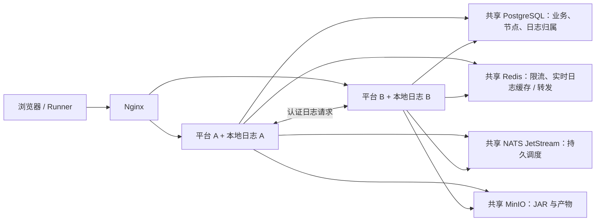

# Full 多机器部署

本模板将 PostgreSQL、Redis、NATS JetStream、MinIO、平台 Web/worker 和 Nginx 分开部署。
每个组件可放在独立机器；多个平台节点连接同一套基础设施。日志正文留在所属节点的本地
SQLite 文件中，节点归属和确认水位保存在 PostgreSQL，Redis 缓存并转发近期实时日志。



## 1. 地址与镜像

示例规划：Nginx `10.20.0.10`，平台 A/B `10.20.0.11/12`，PostgreSQL `10.20.0.21`，
Redis `10.20.0.22`，NATS `10.20.0.23`，MinIO `10.20.0.24`。

所有平台节点使用同一个构建的 AutoForge 镜像，不能混用旧版本、独立重建或不同架构构建。
校验 Release 签名和镜像 tar 后在每台平台机器导入。基础设施及 Nginx 按模板中固定的 digest
在联网准备机获取，通过 `docker save` / `docker load` 带入部署区。模板全部设置
`pull_policy: never`，生产启动不访问镜像仓库。

节点之间需要双向访问各自 Web 端口；基础设施端口只向平台节点及必要的运维来源开放。
MinIO S3 API 必须同时能被平台、Runner 和使用预签名 URL 的浏览器访问。跨不可信网络部署时，
为这些内部通道提供可信 CA 签发的 TLS；示例 HTTP 和未加密数据库端口只适用于受控内网。
Nginx 示例监听 HTTP；生产可在企业 TLS 入口后使用，或在此 Nginx 上配置证书和 HTTPS 监听。
如前方另有 TLS 代理，必须由该可信代理设置并由 Nginx规范化转发协议，不能直接信任客户端提供的
`X-Forwarded-*`。当前示例由本机 `$scheme`、`$http_host` 和 `$remote_addr` 覆盖这些头。

## 2. 独立启动基础设施

在准备机的 `infrastructure` 目录生成一次凭据：

```bash
node prepare-secrets.mjs
```

该脚本仅需要预置 Node.js，不联网；也可以通过已导入的 AutoForge 镜像运行 Node.js。
生成的 `secrets/` 权限为 `0700`，文件为 `0600`，不会打印凭据。将各服务所需文件安全传到
对应机器；保留同一组凭据用于填写平台配置。不要在多台机器分别重新生成同一个服务的凭据。

在每台基础设施机器复制 `infrastructure` 模板，执行 `cp .env.example .env`，将
`AUTOFORGE_SERVICE_BIND` 改为该机器的内网 IP，然后只选择本机需要的 profile：

```bash
docker compose --profile postgres config --quiet
docker compose --profile postgres up --detach
# Redis 机器改用 --profile redis；NATS 机器用 --profile nats。
# MinIO 机器用 --profile minio，同时运行创建 bucket 的一次性任务。
```

同机部署多个组件可重复指定 `--profile`。NATS 配置启用 token 认证；Redis 启用密码认证；
PostgreSQL 和 MinIO 使用各自的 secret 文件。监控/控制台端口不对宿主机发布。

## 3. 准备第一份平台配置

已有 Full 平台：停止 Web 和 worker，保留其数据卷作为节点 A，并复制原来的
`config/platform.json` 到安全的准备目录 `source/config/platform.json`。

全新安装：先用新镜像和节点 A 的持久卷启动一个临时平台，按[单机部署说明](../README.md)
完成 Full 初始化和管理员创建。Full 地址填写上述跨机器地址；NATS Token 填
`secrets/nats-token` 的值，Redis URL 使用 `redis://:密码@10.20.0.22:6379`，MinIO 使用共同
可达的 S3 地址。数据库、MinIO 凭据与生成文件一致。把外部/Runner 访问地址都设为 Nginx 入口，
然后停止临时平台，复制配置，保留数据卷。

第一份配置需要包含 `mode: full` 及完整 `full` 连接信息。Web 监听保持 `0.0.0.0:3000`，
worker 健康端口保持 `3001`；容器外端口可以通过各节点 `.env` 调整。

## 4. 生成节点身份与共享配置

以下命令在准备目录运行，`AUTOFORGE_BACKEND_IMAGE` 是已验证并导入的镜像 tag：

```bash
docker run --rm --pull never --user "$(id -u):$(id -g)" \
  --volume "$PWD:/input" "$AUTOFORGE_BACKEND_IMAGE" \
  node apps/web/dist-server/server/prepare-node.js \
  /input/source/config/platform.json /input/node-a/config/platform.json original
docker run --rm --pull never --user "$(id -u):$(id -g)" \
  --volume "$PWD:/input" "$AUTOFORGE_BACKEND_IMAGE" \
  node apps/web/dist-server/server/prepare-node.js \
  /input/source/config/platform.json /input/node-b/config/platform.json new
```

`original` 保留原节点 ID；`new` 生成新节点 ID。命令校验配置并拒绝覆盖已有输出。
共享密钥、Full 连接信息、时区与调度配置均从同一份来源保留；**不要给不同节点重新生成共享秘密**。
不同机器的 `nodeId` 必须不同；恢复同一节点时则必须保留原来的 ID 和日志卷。

将每份配置放到对应机器的 `platform/config/platform.json`，权限 `0600`，属主为后端镜像
运行账号 UID 1000。复制平台 `.env.example` 为 `.env`，设置镜像、节点自身 IP 和持久卷名称。
节点 A 指向原有日志数据卷；节点 B 使用全新空卷。只复制配置，不复制节点 A 的日志目录。

## 5. 启动平台、填写节点地址并接入 Nginx

先启动节点 A，让它登记已有本地日志的所属节点，再启动新节点：

```bash
docker compose config --quiet
docker compose --profile worker up --detach
curl --fail http://本节点IP:3000/api/v1/health/ready
```

Web 与同机 worker 挂载同一数据卷；不同机器不共享 SQLite 文件，不需要 NFS。
每个节点可启用 worker profile，多个 worker 共享持久 consumer 和 PostgreSQL outbox，
执行状态和租约仍以 PostgreSQL 的条件状态迁移为准。

登录任一节点，在 **平台设置 → 平台节点** 中填写所有节点的名称、直接 IP 和端口。例如：

| 节点 | 内部访问地址 |
| --- | --- |
| 平台 A | `http://10.20.0.11:3000` |
| 平台 B | `http://10.20.0.12:3000` |

这些地址必须直接指向相应节点，不能填写 Nginx 的负载均衡地址。保存会写入共享 PostgreSQL，
后续节点请求立即使用新地址。接口只允许持有平台管理权限的用户修改，并记录操作审计。

在 Nginx 机器修改 `edge/nginx.conf` 中的 `platform` upstream 和 `terminal_gateway` 地址，
复制 `.env.example` 为 `.env` 后启动：

```bash
docker compose config --quiet
docker compose run --rm nginx nginx -t
docker compose up --detach
curl --fail http://10.20.0.10/api/v1/health/ready
```

Nginx 保留 Host、规范化转发头、透传 WebSocket 并关闭响应缓冲；不重放已发送的非幂等请求。
`/api/v1/internal/` 在 Nginx 入口返回 404，节点日志互访直接访问节点地址并使用 HMAC 认证。
Nginx 社区版配置使用被动故障摘除；返回头 `X-Autoforge-Node` 可用于核对请求落点。

## 6. 运维边界

- 日志写入时选择一个批次所属节点，正文、分页和搜索始终从该节点读取。节点故障、地址缺失
  或磁盘文件丢失返回明确的 503；恢复原节点后可继续读取，不自动转移或丢弃日志。
- Redis 近期日志缓存最多 128 个 attempt，各 256 KiB / 32 帧、120 秒 TTL；超过缓存窗口的
  内容从本地权威日志分页读取。缓存丢失不会丢失已经持久化的正文，实时流可能短暂中断。
- 平台公共配置在分布式模式下由部署文件管理，页面只读；变更公共配置时同步所有节点并重启。
  节点地址独立在页面管理。数据库连接池预算按全部 Web、工作线程和 worker 的总数规划。
- 交互终端首版固定到节点 A。该节点故障时终端不可用；恢复它或人工切换网关并让 Agent 重连。
  本版本不声明终端会话迁移、日志多副本或基础设施自动高可用。
- 备份必须覆盖 PostgreSQL、MinIO、**每个节点的配置与日志卷**。共享数据库备份不能代替日志
  卷备份。删除或重装节点前先保留原 ID 和数据；本版本不提供自动节点注销或日志迁移。
- 存储目录清单显示当前请求节点的本地文件；日志详情和批次日志容量通过共享归属记录跨节点访问。
- 从已有版本升级时先停止所有旧实例，备份并让原日志节点先完成登记。升级失败可恢复完整备份；
  分布式已写入数据后，不应直接切回旧单机代码读取分散的日志。

## 验证

独立 GitHub Actions 流水线 **Full distributed acceptance**（`.github/workflows/distributed.yml`）
在相关代码 push / PR 时运行，也可手工触发。三个隔离分组分别检查：

- 存储与队列契约：Lite/Full 日志持久化、唯一归属、旧日志登记、缺失文件、孤儿清理、PostgreSQL 迁移，
  SQLite / JetStream 队列，以及 Redis 近期缓存的大小边界。
- 双平台与故障恢复：真实 PostgreSQL/Redis/NATS/MinIO、两个独立 Web / worker 与 Nginx；编辑节点地址、
  共享登录、内部认证与防重放，通过 Runner 日志上传 HTTP 接口写入并从两个 WebSocket 收到脱敏日志；
  重启 Redis 后持久日志仍可读、实时推送恢复；停止日志节点后另一节点明确返回 503、入口登录仍可用，
  重启原节点后同一日志内容恢复且归属不变。
- 真实 Go Runner：通过 Nginx 注册和执行 TestNG JAR，核对第二个平台读取同一执行和日志、产物下载、
  失败重试、Agent 重启 reconcile、基础设施故障恢复和交互终端。

所有分组通过才允许 `Distributed acceptance gate` 成功。结果校验拒绝空报告、跳过、预期失败与
重试后成功；无论成功失败均保存测试 JSON、截图/失败 trace 和脱敏服务诊断，不上传平台配置或数据卷。
该验收模拟同一 Linux runner 上的隔离节点目录与独立端口，不声称覆盖跨机网络分区、日志多副本或基础设施 HA。

本地可运行 `pnpm test:distributed` 执行双平台与故障恢复分组。该开发验收需要 Linux、Docker、Node 24、pnpm 与预置 Chromium，准备阶段会下载
固定校验和的测试基础设施；它不是生产离线启动命令。

协议与回滚决策见 [ADR 0012](../../../docs/adr/0012-full-distributed-node-local-logs.md)。
反向代理细节参考 [Nginx WebSocket 文档](https://nginx.org/en/docs/http/websocket.html) 和
[代理重试规则](https://nginx.org/en/docs/http/ngx_http_proxy_module.html#proxy_next_upstream)。
