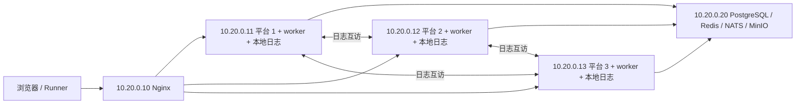

# Full 五主机部署：三个平台 + Nginx + 共享基础设施

本目录提供五台主机各自完整的 `docker-compose.yml` 和 `.env.example`，不使用跨目录
`include` / `extends`。三个平台默认同时启动 Web 与 worker；基础设施主机部署
PostgreSQL、Redis、NATS JetStream、MinIO 和 bucket 初始化任务，无需选择 profile。

## 主机与地址

以下 IP 是可替换的受控内网示例，不要求域名、外部 DNS 或 hosts 文件配置。

| 主机           | 示例 IP      | 应复制的目录      | 对外服务                                                      |
| -------------- | ------------ | ----------------- | ------------------------------------------------------------- |
| 平台 1         | `10.20.0.11` | `platform-1/`     | Web `3000`；worker 仅容器内 `3001`                            |
| 平台 2         | `10.20.0.12` | `platform-2/`     | Web `3000`；worker 仅容器内 `3001`                            |
| 平台 3         | `10.20.0.13` | `platform-3/`     | Web `3000`；worker 仅容器内 `3001`                            |
| Nginx          | `10.20.0.10` | `nginx/`          | 统一入口 `80`                                                 |
| 数据库与中间件 | `10.20.0.20` | `infrastructure/` | PostgreSQL `5432`、Redis `6379`、NATS `4222`、MinIO S3 `9000` |

访问地址为 **`http://10.20.0.10`**。替换 IP 时同步修改各主机 `.env`、
`nginx/nginx.conf` 中三个平台的 upstream，以及下面生成的平台配置中的共享服务地址。
Nginx 使用 `default_server` / `server_name _`；所有 upstream 均填写 IP 和端口。



三个平台之间必须双向访问 `3000`。中间件端口向三个平台开放；MinIO 的 `9000` 还需能被
Runner 和浏览器访问，用于受控上传/下载。NATS 监控和 MinIO Console 不发布到宿主机。

## 1. 获取 Release 与准备镜像

校验同一 Release 的签名、`SHA256SUMS` 和清单，解压 `autoforge-deploy-VERSION.tar.gz`。
本目录位于解压后的 `autoforge-deploy-VERSION/full-five-hosts/`，与 Lite、单机 Full、通用
分布式模板一起发布，受同一部署资产摘要与 SBOM 覆盖。

三个平台必须导入同一构建、同一架构的后端镜像，不要混用不同架构或独立重建的 Next.js 镜像。
以下示例使用 `amd64`，`VERSION` 替换为实际发布版本：

```bash
docker load --input autoforge-backend-VERSION-amd64.docker.tar
```

在联网准备机按 `infrastructure/docker-compose.yml` 和 `nginx/docker-compose.yml` 中固定的
镜像 digest 获取基础设施与 Nginx 镜像，通过 `docker save` / `docker load` 带入对应主机。
所有 Compose 都设置 `pull_policy: never`；部署启动不会自动下载镜像。

## 2. 准备并启动基础设施主机

在准备机上进入本目录，使用发布包内同一份凭据生成器：

```bash
node ../distributed/infrastructure/prepare-secrets.mjs infrastructure/secrets
```

没有宿主机 Node.js 时，可以用已导入的后端镜像执行同一脚本：

```bash
docker run --rm --pull never --user "$(id -u):$(id -g)" \
  --volume "$PWD/..:/deploy" autoforge/backend:VERSION-amd64 \
  node /deploy/distributed/infrastructure/prepare-secrets.mjs \
  /deploy/full-five-hosts/infrastructure/secrets
```

二选一执行一次。生成器拒绝覆盖已有凭据，目录权限 `0700`、文件权限 `0600`，不打印秘密。
保留这些文件用于填写平台连接信息；不要为各个平台重新生成数据库或消息服务密码。

把整个 `infrastructure/`（包含生成的 `secrets/`）复制到 `10.20.0.20`。在该目录执行：

```bash
cp .env.example .env
# 修改 AUTOFORGE_SERVICE_BIND 为本机 IP，核对持久卷名称。
docker compose config --quiet
docker compose up --detach --wait postgres redis nats minio
docker compose run --rm --no-deps minio-init
docker compose ps
```

确认四个常驻服务健康，初始化命令以状态 `0` 退出并创建 `autoforge-objects` bucket。
不要对包含 `minio-init` 的整套服务执行 `up --wait`：Compose 会把这个一次性任务的正常退出
视为等待失败。上面的初始化命令可重复执行，已有 bucket 会保留。
默认 PostgreSQL `max_connections=200`，对应 `.env` 的 `AUTOFORGE_POSTGRES_MAX_CONNECTIONS`。
平台 `databasePoolMax=10` 时，三个 Web 主池、三个 Web 调度线程总池和三个 worker 池的预算
合计最多约 `90` 条连接；提高平台连接池或增加节点时需要同时重算数据库容量。

## 3. 准备唯一的 Full 源配置

已有 Full 平台需要先停止旧 Web / worker 并备份；若迁移基础设施，先恢复原 PostgreSQL 与
MinIO 数据。提取原 `config/platform.json` 到 `source/config/platform.json`，保留原应用密钥
和节点 ID，核对下表中的共享服务地址与凭据，并将外部访问地址和 Runner 地址改为
`http://10.20.0.10`，然后跳到第 4 步。平台 1 必须继续使用原平台数据卷；在
`platform-1/.env` 设置其实际卷名。旧实例停止后才能启动分布式版本，原日志节点应先完成日志归属登记。

全新安装时，在平台 1 主机先启动一个临时初始化容器，使用最终的同一数据卷：

```bash
docker run --detach --name autoforge-five-hosts-setup --pull never \
  --publish 10.20.0.11:3000:3000 \
  --volume autoforge-platform-1-data:/var/lib/autoforge \
  autoforge/backend:VERSION-amd64
docker exec autoforge-five-hosts-setup \
  cat /var/lib/autoforge/config/initial-admin-token
```

访问 `http://10.20.0.11:3000/setup`，用一次性令牌完成 Full 配置。连接信息填写：

| 配置                          | 值                                                                                    |
| ----------------------------- | ------------------------------------------------------------------------------------- |
| PostgreSQL URL                | `postgresql://autoforge:密码@10.20.0.20:5432/autoforge`，密码来自 `postgres-password` |
| PostgreSQL 连接池             | `10`                                                                                  |
| NATS 地址                     | `nats://10.20.0.20:4222`                                                              |
| NATS Token                    | `nats-token` 文件内容                                                                 |
| Redis URL                     | `redis://:密码@10.20.0.20:6379`，密码来自 `redis-password`                            |
| MinIO S3 地址                 | `http://10.20.0.20:9000`                                                              |
| MinIO access key / secret key | `minio-root-user` / `minio-root-password` 文件内容                                    |
| MinIO bucket / region         | `autoforge-objects` / `us-east-1`                                                     |

保存后执行 `docker restart autoforge-five-hosts-setup`，回到 `/setup` 创建 Full 管理员。
在平台配置中将外部访问地址和 Runner 访问地址都设为 `http://10.20.0.10`，监听保持
`0.0.0.0:3000`、worker 健康端口保持 `3001`。三个节点的公共配置均从这一份复制。

停止初始化容器，将源配置安全复制到本目录的 `source/config/platform.json`：

```bash
docker stop autoforge-five-hosts-setup
umask 077
mkdir -p source/config
docker cp autoforge-five-hosts-setup:/var/lib/autoforge/config/platform.json \
  source/config/platform.json
docker rm autoforge-five-hosts-setup
```

保留 `autoforge-platform-1-data` 卷。后续配置准备可在该主机或安全准备机完成。

## 4. 生成三个不同的节点身份

在本目录执行，三个输出从同一个源配置生成，所有共享秘密保持一致：

```bash
docker run --rm --pull never --user "$(id -u):$(id -g)" \
  --volume "$PWD:/input" autoforge/backend:VERSION-amd64 \
  node apps/web/dist-server/server/prepare-node.js \
  /input/source/config/platform.json /input/platform-1/config/platform.json original
docker run --rm --pull never --user "$(id -u):$(id -g)" \
  --volume "$PWD:/input" autoforge/backend:VERSION-amd64 \
  node apps/web/dist-server/server/prepare-node.js \
  /input/source/config/platform.json /input/platform-2/config/platform.json new
docker run --rm --pull never --user "$(id -u):$(id -g)" \
  --volume "$PWD:/input" autoforge/backend:VERSION-amd64 \
  node apps/web/dist-server/server/prepare-node.js \
  /input/source/config/platform.json /input/platform-3/config/platform.json new
```

`original` 保留原节点 ID，两个 `new` 各自生成新的节点 ID。命令验证 Full 配置并启用
`deployment: distributed`，拒绝覆盖已存在的输出；不要手工复制同一个节点 ID 给三台主机。

## 5. 分发并启动三个主平台

分别将 `platform-1/`、`platform-2/`、`platform-3/`（含各自生成的 `config/`）复制到对应主机。
每台主机进入自己的目录执行：

```bash
cp .env.example .env
# 修改镜像、AUTOFORGE_NODE_BIND 和卷名；发布包的示例镜像已替换成实际 VERSION。
sudo chown 1000:1000 config/platform.json
sudo chmod 0600 config/platform.json
docker compose config --quiet
docker compose up --detach --wait
docker compose ps
```

先启动平台 1，确认就绪后再启动平台 2、3。每台的 Web 与 worker 共用本机日志卷，三个主机
使用三个不同卷；平台 2、3 使用新空卷，不复制平台 1 的 SQLite 日志目录，不需要 NFS。

依次检查 `http://10.20.0.11:3000/api/v1/health/ready`、`.12` 和 `.13` 的同一路径。
登录任一平台，在“平台设置 → 平台节点”中按节点 ID 填写：

| 节点   | 节点内部地址             |
| ------ | ------------------------ |
| 平台 1 | `http://10.20.0.11:3000` |
| 平台 2 | `http://10.20.0.12:3000` |
| 平台 3 | `http://10.20.0.13:3000` |

必须填写节点自身的 IP，不能填 Nginx 地址。保存后任意平台均可转发读取其他节点的日志。

## 6. 启动 IP 入口 Nginx

把 `nginx/` 复制到 `10.20.0.10`，核对 `nginx.conf` 中三个平台的 IP 和端口，在该目录执行：

```bash
cp .env.example .env
docker compose config --quiet
docker compose run --rm --no-deps nginx nginx -t
docker compose up --detach --wait
curl --fail http://10.20.0.10/api/v1/health/ready
```

浏览器和 Runner 统一访问 `http://10.20.0.10`。普通请求在三个平台间分发，支持 WebSocket，
关闭日志响应缓冲，内部节点接口在入口返回 `404`。可用响应头 `X-Autoforge-Node` 核对请求落点。
交互终端固定到平台 1；该节点故障后需人工切换 `terminal_gateway` 并让 Agent 重连。

## 备份、升级与发布边界

- 日志正文保存在所属平台的本地卷；PostgreSQL 只保存节点归属与确认水位。Redis 的近期缓存
  可以重建。所属节点离线时对应历史日志明确返回不可用，不自动复制或迁移日志。
- 基础设施集中在一台主机，本模板不提供数据库/中间件高可用。备份需要共享 PostgreSQL、MinIO，
  以及三个平台各自的配置、节点 ID 和日志卷；同一停止窗口内收集，不能只备份数据库。
- 升级前停止三个 Web / worker 并完成备份，同步三台相同的已验证镜像与公共配置，再逐台启动。
  不运行 `docker compose down --volumes` 删除持久数据。分布式配置在页面只读，公共配置变更需同步到三台。
- 本目录自动纳入标准 `autoforge-deploy-VERSION.tar.gz`。Release 打包会检查五份 Compose、
  五份 `.env.example`、Nginx 配置和本说明是否齐全；实际 `.env`、`config/`、`secrets/` 和数据卷
  不进入发布包。后端镜像和基础设施镜像仍按前述方式分别导入。

通用节点协议、详细故障边界和验收范围见 [Full 分布式说明](../distributed/README.md)。
