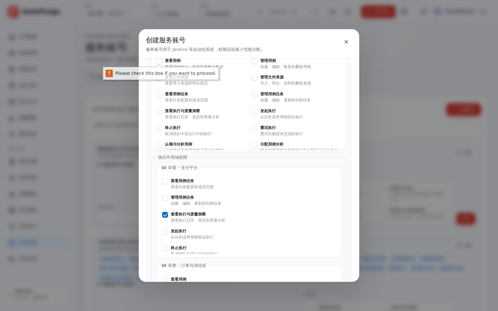
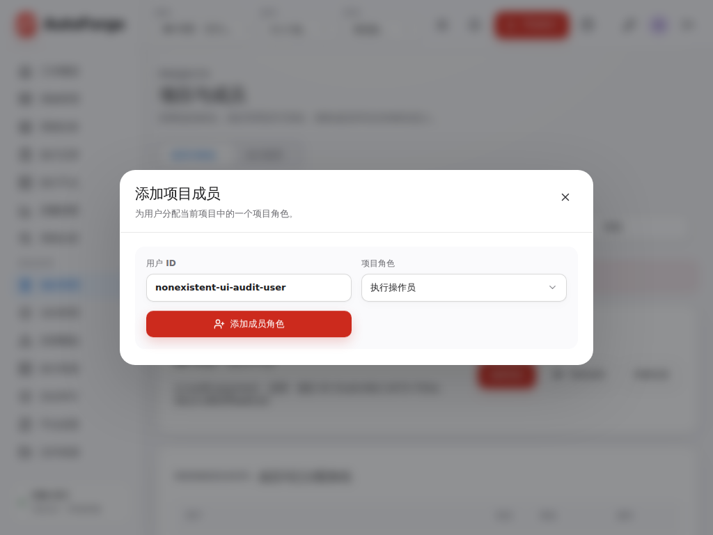
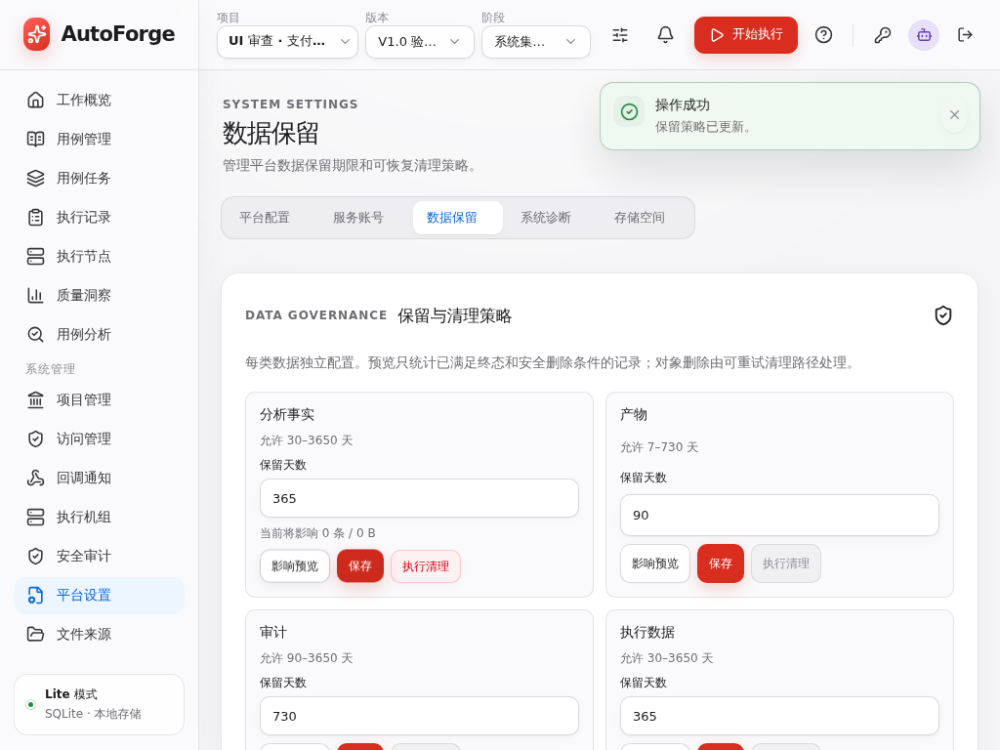

# 平台管理 UI 与操作流程审查报告

审查日期：2026-09-22。范围：侧栏“系统管理”下的全部 7 个入口、16 个子页面，以及相关创建、授权、编辑和详情弹窗。

本文保留基于 `475198f` 工作树的首轮审查记录，并在第 12 节逐项记录本轮修复及验证。第 1～9 节和原始截图描述的是修复前状态，不代表发布后的界面。此前的用例分析与复制信息改动一并保留和回归。

## 1. 首轮结论与优先顺序

当前问题不只是颜色或间距。管理页已有统一侧栏、基础控件和弹窗，但业务组件仍大量采用“直接铺开表单和权限”的组织方式，缺少适合管理员反复操作的选择、对照、反馈和批量处理能力。

本报告列出 **35 项问题或改进项**，分别标明实际复现、代码确认或体验建议。优先处理：

1. 服务账号、角色、令牌的权限选择：全选、取消全选、分组、搜索、已选数量，以及系统/项目范围的明确区分。
2. 已确认的流程缺陷：仅项目授权被阻止、弹窗错误落到背景页、修改保留策略后仍沿用旧预览、候选用户受当前列表限制。
3. 管理列表与长表单：把低频编辑收进弹窗，降低行高和标题区占用，统一底部分页与空状态。
4. 节点、诊断、存储、投递记录等运维页面：让状态、影响和下一步操作更明确。

本次未发现所检查页面出现整页横向溢出，但用户列表在 1024px 下存在内部横向滚动及右侧操作初始不可完整看到的问题；“页面不溢出”不代表操作布局已经合理。

### 审查方法与边界

- Playwright + Chromium，使用现有生产构建；视口为 **1024×768、1536×960**。实际打开页面、操作弹窗、生成截图并查看截图。
- Lite 使用隔离 SQLite 数据目录，创建示例项目、版本、阶段、用户、服务账号和空执行机组。数据均为本地审查样例。
- Full 使用独立 PostgreSQL、Redis、NATS、MinIO 容器及独立 Web 实例，实际检查平台节点、分布式只读配置、基础设施和诊断页。不是用截图模拟 Full 页面。
- 检查了初始空态、列表有数据、长名称、无搜索结果、创建失败、配置草稿切换和保留预览过期等场景。
- 未执行真实 Runner 任务、LDAP 外部目录连接、Webhook 外发通知、生产清理或跨节点故障注入。本报告不等同于完整业务或性能验收。
- 无实际 Runner 成员时的机组选择能力、超过 50/100 条的数据可达性、过期令牌状态等，结合对应代码确认，不冒充大规模浏览器实测。

标记含义：**实测**＝浏览器复现并核对实现；**代码**＝实现中可确认，本次未构造全部运行条件；**建议**＝现有功能可以操作，但有明确的体验改进空间。P1 应先解决流程或操作风险；P2 为下一批可用性与布局优化；P3 为已有良好页面的细节完善。

## 2. 全部页面覆盖

| 管理入口 | 子页面 / 路由                              | 本次检查内容                                       | 主要结论                                          |
| -------- | ------------------------------------------ | -------------------------------------------------- | ------------------------------------------------- |
| 项目管理 | `/settings/projects?section=members`       | 成员列表、添加成员、错误反馈、角色管理实现         | 手填 UUID；候选范围与列表耦合；项目摘要占用较大   |
| 项目管理 | `section=execution`                        | 版本/阶段树、创建和继承实现、JDK/依赖配置          | 运行资源表单全铺开；标题与说明挤在同一层级        |
| 访问管理 | `/settings/access?section=users`           | 用户列表、长名称、空搜索、创建、分配角色、重置密码 | 行高及操作拥挤；空态缺失；部分操作限当前页用户    |
| 访问管理 | `section=roles`                            | 系统绑定、角色卡片、创建角色失败、权限选择         | 筛选在列表下方；角色主体靠后；错误不在弹窗内      |
| 访问管理 | `section=ldap`                             | 关闭/启用状态及上下部表单                          | 未启用时仍显示整张长表单；测试反馈可更明确        |
| 访问管理 | `section=sessions`                         | 真实登录会话列表、操作实现                         | 无当前会话标识，难以识别应该终止哪条              |
| 回调通知 | `/settings/webhooks`                       | 空态、创建弹窗、模板、投递列表实现                 | 模板变量和测试入口已有；缺少模板预览及历史检索    |
| 执行机组 | `/runners?section=groups`                  | 空态、创建弹窗、空成员组及成员选择实现             | 成员选择不能批选/筛选；创建和编辑组织方式不同     |
| 安全审计 | `/audit`                                   | 真实审计记录、筛选、展开详情                       | 基础能力较完整；窄屏列距和对象识别需优化          |
| 平台设置 | `/settings/platform?section=configuration` | Lite 配置、草稿离开；Full 分布式只读状态           | 长表单缺导航/固定操作；未保存改动可直接丢失       |
| 平台设置 | `section=accounts`                         | 账号列表、创建、仅项目授权、权限矩阵               | 本轮优先级最高：批选缺失、范围校验错误、信息过载  |
| 平台设置 | `section=retention`                        | 预览、修改、保存后的按钮状态；未执行清理           | 旧预览未失效；“可恢复”描述与删除语义冲突          |
| 平台设置 | `section=diagnostics`                      | Lite 正常；Full 依赖缺失及恢复后的页面             | 现有结构可保留，增强错误说明与处理路径            |
| 平台设置 | `section=storage`                          | 首次扫描、快照完成后的概览、目录实现               | 已有后台快照和树；摘要占屏较多、文件区靠后        |
| 平台设置 | `section=nodes`（Full）                    | 真实节点登记、地址表单                             | UUID 重复突出；缺少连通状态与当前节点标识         |
| 文件来源 | `/objects`                                 | 空态、列表与操作代码                               | 固定读取 100 条，无继续浏览入口；技术对象键占主位 |

`/settings` 与 `/settings/automation` 为重定向入口，不另计页面。用例管理、任务、分析等业务工作台不属于本轮管理区范围。

## 3. 服务账号、权限与令牌

实现依据：[OperationsSettings](../../apps/web/src/components/operations-settings.tsx)、[CheckboxGroup](../../apps/web/src/components/ui.tsx)、[服务账号契约](../../packages/contracts/src/operations.ts)。

| 编号  | 优先级 / 依据 | 问题与影响                                                                                                                                                                    | 建议及验收目标                                                                                                                                          |
| ----- | ------------- | ----------------------------------------------------------------------------------------------------------------------------------------------------------------------------- | ------------------------------------------------------------------------------------------------------------------------------------------------------- |
| UI-01 | P1 · 实测     | 权限只能逐个勾选；没有全选、取消全选、分组全选、搜索和已选计数。服务账号系统/项目权限、令牌作用域、自定义角色均复用此控件。                                                   | 做共享权限选择器：按业务分组、支持组内半选、搜索名称/说明、展示已选数量；“全选当前范围”和“取消当前范围”边界明确。勾选阶段只改本地草稿，保存时一次提交。 |
| UI-02 | P1 · 实测     | 创建服务账号时“系统权限”被标记为必选。只选择项目权限仍被原生校验阻止，用户被迫添加不需要的全局权限。后端契约允许 `systemPermissions: []`，实测通过 API 能创建仅项目授权账号。 | 去掉系统权限单独必选，按服务账号整体授权规则校验。仅项目权限账号应可直接创建，不能为了通过表单而扩大授权范围。                                          |
| UI-03 | P1 · 实测     | 创建弹窗同时渲染所有项目的全部权限；本地 4 个项目即有 150 个复选框。弹窗滚动中还嵌套 300px/240px 权限滚动区，难以确认勾选落在哪个项目。                                       | 先选择需要授权的项目，再编辑该项目权限；项目列表显示已选数量及权限摘要。只展开当前编辑范围，保持其他项目草稿，禁止跨项目隐式全选。                      |
| UI-04 | P2 · 实测     | 每个账号卡片默认铺开签发令牌表单；全权限账号占大量高度。列表只展示系统权限标签，项目权限不能直接看清。3 个账号页面已有约 1530px 高度。                                        | 列表只保留账号名称、状态、用途、授权项目/权限摘要和操作；账号编辑、签发令牌、令牌列表分别按需打开。增加名称/状态筛选，账号量大时有界读取。              |
| UI-05 | P1 · 代码     | 令牌行只按撤销、账号禁用、最近使用判断状态，没有将 `expiresAt` 与当前时间比较，已过期令牌仍可能显示“从未使用”或“最近使用”。后端失效并不代表前端状态正确。                     | 独立显示有效/已过期/已撤销/随账号禁用失效；最近使用作为另一列。测试过期但未撤销、过期且曾使用等组合。                                                   |
| UI-06 | P2 · 代码     | 令牌复制直接调用 `navigator.clipboard.writeText`，没有成功/失败反馈与失败处理。无法判断是否成功复制一次性明文。                                                               | 复用统一复制能力，右上角反馈结果；失败时保留明文和可手动选择的内容，不重复签发。                                                                        |



上图已勾选项目内的“查看执行与质量洞察”，提交却回到系统权限组要求勾选。截图中的英文气泡来自本次 Chromium 的原生表单校验，不是产品自定义提示。

[账号列表全量铺开签发表单的截图](./platform-management-audit-2026-09-22/platform-accounts-1536.png)。

### 权限选择器的具体交互建议

- 顶部：当前授权范围、搜索框、`已选 n / 可选 m`、全选/取消全选。
- 中间：用例资产、任务执行、分析、执行节点、身份与权限、平台运维等分组；每组支持全选和半选。
- 项目授权：先选项目，保留项目列表及各项目已选数量；系统权限作为独立范围。
- 搜索后按钮明确写“全选搜索结果 / 取消搜索结果”；未匹配但已选的权限继续保留，并能单独查看“已选”。
- 令牌选择只展示该账号实际可授予的作用域。默认不全选；任何模板/批选都不能超过可授予范围。
- 模板可从常见 Jenkins 执行、只读查询等场景起步，但须明确展示实际权限，不绕过后端授权。

## 4. 项目、成员与执行资源

实现依据：[项目页](../../apps/web/src/app/settings/projects/page.tsx)、[成员管理](../../apps/web/src/components/project-membership-manager.tsx)、[执行资源管理](../../apps/web/src/components/project-structure-manager.tsx)。

| 编号  | 优先级 / 依据 | 问题与影响                                                                                                                                  | 建议及验收目标                                                                                                                                  |
| ----- | ------------- | ------------------------------------------------------------------------------------------------------------------------------------------- | ----------------------------------------------------------------------------------------------------------------------------------------------- |
| UI-07 | P1 · 实测     | “添加项目成员”要求手填用户 UUID，必须离开当前工作流找 ID，不能按姓名/账号查找，也不能批量添加。                                             | 提供已有用户检索与多选，显示姓名、账号、状态和是否已加入；选择角色后统一提交并反馈逐项结果。只查当前管理员允许操作的候选。                      |
| UI-08 | P1 · 代码     | 转移负责人使用当前 `members`；全局分配角色和重置密码使用当前 `users`。这些数据已按查询条件及 50 条窗口截断，弹窗候选随主列表筛选/页码改变。 | 弹窗独立按需搜索候选，不复用主列表当前页作为完整候选集。验证目标用户在其他页、主列表有筛选、目标已禁用等情况。                                  |
| UI-09 | P2 · 实测     | 成员搜索单独占一行，项目摘要再占一张大卡，成员表第三层才出现；项目和用户 UUID 在主视图占较大篇幅。                                          | 保留搜索在子 Tab 下方的现有正确位置；将项目状态与操作收进紧凑摘要，成员工具栏与表格相邻。ID 放详情或复制入口。                                  |
| UI-10 | P2 · 实测     | JDK/依赖页面同时展开上传、URL 登记、其他版本继承及删除入口。两个相似资源表单长期并排，当前资源状态却只是一句文字。                          | 先展示当前版本的 JDK、依赖包卡片，突出名称、更新时间、大小、来源；“更新资源”再选择上传或链接。保留现有全量覆盖语义，不能重新引入历史 JAR 补充。 |

[运行资源区两个表单平铺的截图](./platform-management-audit-2026-09-22/project-runtime-assets-bottom-1536.png)。

## 5. 弹窗反馈与草稿保护

实现依据：[ActionDialog](../../apps/web/src/components/action-dialog.tsx)、[访问管理](../../apps/web/src/components/access-settings.tsx)、[成员管理](../../apps/web/src/components/project-membership-manager.tsx)、[执行机组管理](../../apps/web/src/components/runner-group-manager.tsx)、[平台配置](../../apps/web/src/components/platform-settings.tsx)。

| 编号  | 优先级 / 依据    | 问题与影响                                                                                                                                  | 建议及验收目标                                                                                                                                                  |
| ----- | ---------------- | ------------------------------------------------------------------------------------------------------------------------------------------- | --------------------------------------------------------------------------------------------------------------------------------------------------------------- |
| UI-11 | P1 · 实测 + 代码 | 添加不存在的成员、创建重复角色时，错误写到主页面 `auth-error`，弹窗里没有错误。执行机组创建等也存在相同结构。用户看到的只是提交后没有变化。 | 表单校验和请求错误显示在操作所在弹窗内；定位具体字段并保留草稿。成功继续使用右上角反馈。优先复用已做好的创建用户、分配用户角色等实现。                          |
| UI-12 | P1 · 实测 + 代码 | 平台时区改为 `Europe/London`，未保存切到服务账号再返回，恢复成 `Asia/Shanghai`，没有离开确认。通用弹窗关闭也没有统一的草稿脏状态机制。      | 长表单显示未保存状态；离开时提供继续编辑/放弃，或保留不含敏感值的当前页面草稿。弹窗关闭要根据是否有改动处理，不能一律无提示丢弃。密码与令牌不写浏览器持久缓存。 |



该截图对应不存在的用户提交，主页面已产生错误区域，但被遮罩与弹窗隔离；弹窗自身的错误区域数量为 0。重复角色也复现相同问题。

## 6. 用户、角色、LDAP 与会话

实现依据：[访问管理页](../../apps/web/src/app/settings/access/page.tsx)、[AccessSettings](../../apps/web/src/components/access-settings.tsx)、[UserRoleAssignmentDialog](../../apps/web/src/components/user-role-assignment-dialog.tsx)。

| 编号  | 优先级 / 依据    | 问题与影响                                                                                                                                    | 建议及验收目标                                                                                                                                     |
| ----- | ---------------- | --------------------------------------------------------------------------------------------------------------------------------------------- | -------------------------------------------------------------------------------------------------------------------------------------------------- |
| UI-13 | P2 · 实测        | 用户行把分配角色、禁用、撤销会话同时显示，1024px 下纵向堆叠；表格容器约 726px，内容约 766px，操作初始不能完全看到。6 个用户页面约 1560px 高。 | 保留“分配角色”主操作，低频/危险动作进更多菜单；姓名和账号保留，ID 移入详情。长姓名两行内展示并可查看全文，操作列在最小桌面宽度下完整可用。         |
| UI-14 | P2 · 实测        | 搜索不存在用户后只剩表头，既无“没有匹配用户”，也无清空条件入口。                                                                              | 区分首次没有账号和筛选无结果；提示当前条件并提供清空/返回。创建动作仍按权限展示。                                                                  |
| UI-15 | P2 · 实测 + 代码 | 用户页已能分配角色，但弹窗只提供“新增分配”，没有完整展示当前已分配角色及就地撤销路径；系统/项目角色只能一次分配一个。                         | 升级为同一用户的角色管理面板：按范围列已分配角色，新增候选排除已有绑定；按需支持多选、变更摘要和保存。保留当前从用户列表直接打开的入口。           |
| UI-16 | P2 · 实测        | 角色页先是用户系统角色绑定表，筛选框在该表之后，角色本身更靠下；卡片平铺所有权限标签，难以比较作用域与差异。                                  | 角色目录优先展示，按作用域/内置/自定义筛选，列表保留权限数与摘要，详情展开；系统绑定成为单独清晰的区域，筛选紧贴对应列表上方。权限编辑共用 UI-01。 |
| UI-17 | P2 · 实测        | LDAP 未启用仍显示约 1800px 的灰色表单；启用、测试、保存相隔较远。虽然已有 4 组说明，仍缺少紧凑状态摘要及明确测试结果定位。                    | 关闭时展示状态与开启入口；开启后按连接、检索、用户纳管、Group 分区。保留已有测试连接能力，结果紧邻操作显示，说明测试范围与配置保存状态。           |
| UI-18 | P1 · 实测 + 代码 | 会话只列创建、活动、到期三个时间和“终止”；没有当前会话标记，也没有终止前确认。多个接近时间的会话难以识别，可能把正在使用的会话结束。          | 至少标出当前会话，明确终止后的登录影响；在实际可获取的元数据范围内展示设备/来源，提供“退出其他会话”。缺少的元数据需补契约与服务端，不得伪造。      |

[1024px 用户列表](./platform-management-audit-2026-09-22/access-users-1024.png) · [无搜索结果](./platform-management-audit-2026-09-22/user-empty-filter-1024.png) · [角色页](./platform-management-audit-2026-09-22/access-roles-1536.png)

## 7. 平台配置、清理、节点、存储与诊断

实现依据：[PlatformSettings](../../apps/web/src/components/platform-settings.tsx)、[OperationsSettings](../../apps/web/src/components/operations-settings.tsx)、[平台设置页](../../apps/web/src/app/settings/platform/page.tsx)、[PlatformNodes](../../apps/web/src/components/platform-nodes.tsx)、[StorageInventory](../../apps/web/src/components/storage-inventory.tsx)、[SystemDiagnostics](../../apps/web/src/components/system-diagnostics.tsx)。

| 编号  | 优先级 / 依据    | 问题与影响                                                                                                                                | 建议及验收目标                                                                                                                            |
| ----- | ---------------- | ----------------------------------------------------------------------------------------------------------------------------------------- | ----------------------------------------------------------------------------------------------------------------------------------------- |
| UI-19 | P2 · 实测        | 配置把监听、时区、访问地址与容量、会话、调度等混在长表单中；保存按钮在最底部。Full 分布式只读时仍是整张禁用表单。                         | 增加分区导航和底部固定保存区；显示修改数量、即时生效/需重启标识。只读模式用可读的配置摘要，保留部署文件管理边界。                         |
| UI-20 | P1 · 实测 + 代码 | 预览后修改保留天数并保存，`previews` 未清空，旧数量仍显示，“执行清理”仍可点击。确认依据与已保存策略可能不一致。                           | 输入变化时清楚标识草稿；保存新策略后旧预览失效。预览绑定策略修订号并显示生成时间，执行前校验一致性；不能只靠按钮置灰保证正确性。          |
| UI-21 | P1 · 实测 + 代码 | 页头写“可恢复清理策略”，清理确认却明确“删除后的业务记录不可恢复”；对象异步重试并不等于用户可恢复数据。                                    | 统一文案为实际语义：保留策略、影响预览、不可恢复清理；对象删除重试放在任务状态说明。不要暗示存在回收站或恢复入口。                        |
| UI-22 | P2 · 实测 + 建议 | Full 节点初始名称为 UUID，标题、节点 ID、输入框重复出现；只有地址编辑，没有“当前节点”或地址连通状态，难以快速判断节点是否可用于日志读取。 | 紧凑节点列表显示友好名称、当前节点、地址是否配置；提供显式有界连通检查及最后检查时间。连通能力需后端支持，本次未验证跨主机网络。          |
| UI-23 | P2 · 实测        | 存储快照已有统计时间、逻辑大小和实际占用，但摘要、路径说明、分类块占去大部分首屏，目录操作在下方；配置实现说明和可行动信息层级接近。      | 保留后台快照和现有树结构，压缩顶部统计，将路径/统计口径放可展开说明；突出目录、筛选与安全清理。不能以美化为由改成一次加载全部文件。       |
| UI-24 | P3 · 实测 + 建议 | 诊断布局已较完整；Full 缺少 MinIO bucket 时能明确标出对象存储异常，但主要解释直接展示英文底层错误，没有相应处理入口。                     | 保留现有健康概览、容量、时间基准和构建数据。补中文摘要、原始错误折叠/复制与对应运维文档入口；检查异常时提供下一步，不能新增高频自动探测。 |



本次在隔离数据中先按 730 天预览，再改为 365 天保存；旧预览仍存在且清理按钮可用。样例中候选恰好都是 0 条，因此本次证明的是**预览未失效**，不是证明已经误删数据；未执行清理。

[Full 平台节点截图](./platform-management-audit-2026-09-22/full-platform-nodes-1536.png)。

## 8. 回调通知、执行机组、安全审计与文件来源

实现依据：[WebhookSettings](../../apps/web/src/components/webhook-settings.tsx)、[Webhook 页面](../../apps/web/src/app/settings/webhooks/page.tsx)、[RunnerGroupManager](../../apps/web/src/components/runner-group-manager.tsx)、[SecurityAuditTable](../../apps/web/src/components/security-audit-table.tsx)、[文件来源页](../../apps/web/src/app/objects/page.tsx)。

| 编号  | 优先级 / 依据    | 问题与影响                                                                                                                                        | 建议及验收目标                                                                                                                    |
| ----- | ---------------- | ------------------------------------------------------------------------------------------------------------------------------------------------- | --------------------------------------------------------------------------------------------------------------------------------- |
| UI-25 | P2 · 实测 + 建议 | Webhook 有变量插入和测试功能，但创建弹窗同时铺开所有变量、长 JSON 文本；没有保存前的渲染预览与紧邻模板的语法定位。1024px 首屏看不到底部提交。     | 保留变量插入，按用途分组；提供不发送网络请求的样例预览、字段错误和固定操作区。真实“测试发送”保持显式按钮，避免输入即外发。        |
| UI-26 | P2 · 代码        | 投递页面固定读取最近 30 条，没有端点/状态筛选、历史翻页或持续查看更早失败的入口；只能看到最近窗口。                                               | 标明窗口范围，提供按端点/状态筛选及有界历史浏览，失败可展开详情。若增加重新投递，必须单独设计权限和幂等，而非仅增加按钮。         |
| UI-27 | P1 · 代码        | 执行机组成员选择逐个复选，无搜索、全选/取消全选、已选数量；直接输出 `runner.state` 英文值。成员多时难以完成组配置。                               | 按名称/标签/状态筛选，支持全选当前候选与清空、半选和数量，中文状态+图标；遵守现有单组 64 个成员限制，明确已选不可用成员。         |
| UI-28 | P2 · 实测 + 代码 | 执行机组创建在弹窗、编辑在卡片内部；空组卡片仍留较大高度，成功操作缺少统一提示。                                                                  | 创建和编辑使用一致表单容器，列表突出成员数、可用情况和摘要；低频操作收敛，操作成功使用统一反馈。失败位置一并按 UI-11 处理。       |
| UI-29 | P2 · 实测 + 代码 | 安全审计在 1024px 下时间与人员文字靠得很近；对象列表主要是资源类型和 UUID 前 8 位，本次多条 UUIDv7 记录前缀相同，难以区分对象。                   | 调整列宽与时间展示，保证边界留白；优先展示可取得的对象业务名称，完整 ID 放详情及复制入口。不能把截断 ID 当成足够区分的对象标识。  |
| UI-30 | P1 · 代码        | 文件来源页固定调用 `listObjects({limit:100})` 和 `listSources(100)`，未提供游标、下一页或继续加载。超过读取窗口的内容从本页面没有访问路径。       | 在保留有界读取的前提下，增加服务端筛选及完整浏览入口；必须用超过 100 条的来源和对象验证。不能通过一次读取全部数据解决。           |
| UI-31 | P2 · 实测 + 代码 | 文件来源与存储空间概念邻近，但前者列表以对象键为主，且源码/JAR 表、对象表并排堆叠，没有名称/版本/阶段筛选。非运维人员难以确定应从哪个页面找文件。 | 明确“来源资产”和“空间占用”职责；来源优先显示文件名、项目版本/阶段、导入时间、规模、状态，底层对象键进详情。补两页之间的明确入口。 |

## 9. 需要统一处理的页面骨架

实现依据：[全局样式](../../apps/web/src/app/globals.css)、[应用导航](../../apps/web/src/components/app-shell.tsx)、[访问页](../../apps/web/src/app/settings/access/page.tsx)、[项目页](../../apps/web/src/app/settings/projects/page.tsx)。

| 编号  | 优先级 / 依据    | 问题与影响                                                                                                                                   | 建议及验收目标                                                                                                                                                   |
| ----- | ---------------- | -------------------------------------------------------------------------------------------------------------------------------------------- | ---------------------------------------------------------------------------------------------------------------------------------------------------------------- |
| UI-32 | P2 · 实测 + 代码 | 多数管理卡片的英文 eyebrow、中文标题、说明被 `.section-heading > div` 的横向布局排成一行，层级不清；嵌套卡片、浅灰表单和过宽按钮重复占空间。 | 提炼管理页标题、工具栏、内容区、表单分组和底部操作的共同结构。标题/说明纵向组织，操作独立靠右；主要动作突出，次要/危险操作降低视觉权重。继续使用现有语义 token。 |
| UI-33 | P2 · 代码        | 成员、用户、用户绑定列表只有“下一页”，没有一致的上一页/当前页状态；项目成员下一页还放在顶部搜索旁。                                          | 统一结果区底部分页，显示当前页及当前加载数量、上一页/下一页；底层继续用游标。需要总数时来自后台快照并注明时间，不为展示总数每次全表统计。                        |
| UI-34 | P1 · 代码        | 用户列表“禁用”“撤销会话”点击后直接请求；会话页“终止”也直接执行，与同平台撤销系统角色/服务账号的确认流程不一致。                              | 对有会话中断影响的操作显示对象和影响范围，必要时确认；执行期间只禁用相关操作，失败保留当前上下文，成功右上角反馈。与 UI-18 一并验收。                            |
| UI-35 | P2 · 建议        | 全局用户、平台设置与项目管理共享项目/版本/阶段顶栏，但页面没有统一的“全平台/当前项目”范围提示；服务账号还同时支持两类授权。                  | 在管理内容标题或摘要显示实际作用范围。切项目不应让用户误以为全局账号或全局配置只影响当前项目；保留已有全局上下文选择器，不另造第二套切换器。                     |

### 建议保留的现有能力

- 项目成员搜索已在子 Tab 下方，不能改回 Tab 上方。
- 用户列表已提供“分配角色”，创建用户弹窗已有字段提示和局部错误处理；问题是需要扩展管理能力，不是缺少入口。
- 系统诊断已使用构建信息，不是固定显示 `0.2.2`；本地未标记构建显示“开发构建”是合理行为。
- Lite/Full 部署模式为只读信息；Full 分布式配置由部署文件管理，优化显示不意味着开放随手切换。
- Webhook 已有变量插入与显式测试，审计已有筛选/导出/底部分页/展开详情，存储已有快照与目录树、部分资源全选和批量删除。不能把这些已有能力重复当成待开发项。
- 主导航、基础控件、右上角通知及现有中文权限名称可继续复用，无需重新设计整套主题。

## 10. 建议实施批次与验收

| 批次   | 工作范围                                  | 完成标准                                                                                                                  |
| ------ | ----------------------------------------- | ------------------------------------------------------------------------------------------------------------------------- |
| 第一批 | UI-01～06：权限选择器、服务账号和令牌     | 全选/取消/半选/搜索范围清晰；仅项目授权可创建；编辑回显正确；缩权立即生效；令牌状态及复制反馈准确；Lite/Full 共享契约通过 |
| 第二批 | UI-07～18、UI-33～34：用户/项目/角色/弹窗 | 候选跨分页可搜索；错误在弹窗内；用户列表无结果有引导；不误终止当前会话；布局紧凑、长名称可读；不丢未保存内容              |
| 第三批 | UI-19～24：配置、清理、节点、存储、诊断   | 新策略使旧预览失效；清理语义准确；长配置有导航和固定操作；Full 只读信息清晰；节点状态信息来源真实；快照/懒加载保留        |
| 第四批 | UI-25～32、UI-35：其余管理页和视觉统一    | 投递和文件来源能完整有界浏览；机组批选可用；审计对象可辨；标题/工具栏/分页/状态反馈一致                                   |

各批次都先添加缺陷回归，再实现；改变授权、批量写入、预览校验或列表契约时同时验证 Lite/Full。视觉调整不能以全量加载、输入即查询/保存、增加高频后台扫描为代价。

视觉验收至少包含 1024×768 和 1536×960，补一个常用大屏/超宽屏视口；需要实际查看截图。覆盖长中文/英文名称、无数据、无匹配结果、只读权限、保存失败、并发修改、提交中和操作后刷新。仅使用 DOM 断言或编译通过不能替代视觉审查。

## 11. 首轮审查证据

- 首轮浏览器遍历实际访问 15 个 Lite 子页面，每页两种宽度；浏览器 `pageerror` 收集为 0，页面级宽度检查无整页横向溢出。
- Full 补齐节点页及 Full 配置、基础设施、诊断两种宽度截图；另检查对象存储 bucket 缺失时的降级显示，并在创建本地测试 bucket 后重新查看。
- 深入操作记录确认了 UI-02、UI-11、UI-12、UI-14、UI-20 等问题；代码审查补充列表窗口、令牌状态、候选数据范围和危险操作交互。
- 代表性 9 张截图保存在本报告同级的 `platform-management-audit-2026-09-22/`，均为本次实际页面截图；更完整的 82 张截图及测量 JSON 保存在本地 `.local/platform-ui-audit/`，未将本地数据库、会话和凭据纳入文档。
- 首轮仅执行页面巡检与交互复现；修复后的验证独立记录在后文，不把首轮浏览等同于业务回归。

以下是本轮实施结果。建议列中的扩展设想不自动等于本轮已交付能力。

## 12. 本轮逐项处理结果

| 编号  | 实施结果与边界                                                                                                            |
| ----- | ------------------------------------------------------------------------------------------------------------------------- |
| UI-01 | 新增共享选择器：名称/说明搜索、全选/取消当前结果、分组半选、已选计数、仅看已选。筛选不丢失隐藏选择，编辑仅修改本地草稿。  |
| UI-02 | 系统权限不再单独必选；浏览器实测可创建只有项目权限的服务账号。                                                            |
| UI-03 | 项目权限按当前项目范围编辑，切换范围保留其他项目草稿，提交统一保存。                                                      |
| UI-04 | 账号编辑和令牌签发进入弹窗；列表收起权限详情，显示项目数及权限数，提供名称/状态筛选与每页 50 条游标浏览。                 |
| UI-05 | 令牌分别识别账号禁用、已撤销、已过期和可用状态，保留最近使用信息。                                                        |
| UI-06 | 复制令牌使用统一复制能力，成功/失败显示右上角反馈，失败不清除一次性明文。                                                 |
| UI-07 | 项目成员改为已存在用户检索、多选和角色批量分配；输入搜索词后点击查询，每次 25 个候选，保留跨页选择。                      |
| UI-08 | 新增独立候选接口，按操作目的鉴权；负责人候选来自项目成员，密码重置仅列本地用户，不再依赖主表当前页。                      |
| UI-09 | 项目摘要和成员工具栏紧凑排列，搜索仍在子 Tab 下方，减少主视图中的内部 ID。                                                |
| UI-10 | JDK/依赖更新的上传和链接表单按需展开，保持原有资源状态与继承入口；未改变全量依赖覆盖和上传协议。                          |
| UI-11 | 创建角色、成员、版本、阶段、机组、账号等表单错误显示在当前弹窗内；成功继续使用右上角提示。                                |
| UI-12 | 管理弹窗支持关闭前草稿确认；平台配置支持页内导航离开确认和浏览器刷新提示。不把敏感草稿写入浏览器持久缓存。                |
| UI-13 | 用户列表保留“分配角色”主操作，低频动作收进“更多操作”；去除行内 UUID，压缩布局并保证最小字号 12px。                        |
| UI-14 | 增加没有匹配用户的说明与清空条件入口。                                                                                    |
| UI-15 | 角色弹窗显示已有绑定，可就地撤销，多选新增系统或项目角色；后端先校验完整选择，再有界逐项写入，失败返回已完成数量。        |
| UI-16 | 系统绑定收起，筛选在对应表格上方；角色提供名称/作用域筛选，权限默认显示数量并按需展开。                                   |
| UI-17 | LDAP 关闭时隐藏禁用长表单；启用后保留连接、检索和纳管配置。现有连接测试仍需显式点击。                                     |
| UI-18 | 标识当前会话；终止前提示影响；新增退出其他会话，排除当前会话。                                                            |
| UI-19 | 增加配置分区导航、固定保存区和未保存提示；Full 凭据区改为部署管理摘要，不展示空密码输入。其他只读配置仍保留禁用字段展示。 |
| UI-20 | 修改/保存策略立即使旧预览失效；预览携带修订号与生成时间，执行使用预览截止时间，Lite/Full 写入路径都拒绝过期修订。         |
| UI-21 | 清理文案统一为不可恢复删除，去掉误导性的“可恢复清理策略”。                                                                |
| UI-22 | 节点显示友好名称、当前节点、地址配置状态；新增手动签名连通检查及检查时间，验证目标节点身份，不增加后台轮询。              |
| UI-23 | 路径和统计口径收起，缩小分类统计区；保留后台快照、按目录展开加载和现有删除权限。                                          |
| UI-24 | 诊断依赖异常增加中文处理建议，底层原始错误按需展开；保留有界快照和手动刷新。                                              |
| UI-25 | Webhook 模板变量收起，提供本地样例 JSON 预览和语法/变量提示，操作区固定；预览不外发请求。                                 |
| UI-26 | 投递记录增加端点/状态筛选和每页 30 条游标浏览；Lite/Full 使用相同排序及筛选语义。                                         |
| UI-27 | 机组成员复用搜索与批选，显示中文状态、标签和槽位，提交明确校验 64 个上限；候选中缺失的已有成员保留绑定并提示。            |
| UI-28 | 机组创建/编辑统一弹窗，成功统一反馈，失败留在当前表单。                                                                   |
| UI-29 | 调整审计列距与时间换行，优先显示事件内的业务名称；无名称时展示 ID 尾段，完整 ID 保留在详情中。                            |
| UI-30 | 文件来源和对象分别提供每页 50 条浏览与筛选，SQLite/PostgreSQL 都用超过 100 条来源验证跨页可达性。                         |
| UI-31 | 来源文件名成为主信息，对象键收进详情，增加空间管理入口；来源支持名称筛选、对象支持前缀筛选。                              |
| UI-32 | 统一管理区标题纵向层级、工具栏、表单组和底部操作；沿用现有颜色、字号、圆角等语义 token。                                  |
| UI-33 | 用户、成员、绑定、账号、文件、投递统一底部游标导航，显示页码和本页条数；URL 最多保留 5 个历史游标，另提供返回首页。       |
| UI-34 | 禁用用户、撤销会话、终止会话增加对象及影响确认；锁定用户的解锁独立处理，避免误标为禁用。                                  |
| UI-35 | 平台/访问页明确“全平台”，项目和文件页明确当前项目范围，不新增第二套项目切换器。                                           |

### 保留的增强项与兼容边界

以下属于建议中的进一步增强，不作为本次已完成功能：常用权限模板、LDAP 测试结果按字段定位、会话设备/IP 元数据、新增配置逐字段修改计数、文件来源版本/阶段可视选择器、Webhook 人工重新投递。本轮先完成实际流程缺陷和有界浏览，避免随 UI 调整扩大业务规则。

- 草稿保护覆盖弹窗关闭、平台配置页链接和浏览器刷新；浏览器历史后退尚未增加专用拦截。
- 分页显示当前页及本页数量，不虚构总数，也不为计数引入每次访问的全表统计。固定窗口不会阻止继续向后翻页。
- 批量角色分配最多 50 个用户与角色组合，先整体校验，再复用原有幂等写入及审计。部分失败明确反馈完成数量，可重试，不声称跨全部对象原子提交。
- 手动节点检查复用内部签名协议，十秒超时，每节点十秒限流；旧版本节点需要升级才能识别新增 `ping` 操作。既有日志操作协议不变。实际浏览器验证为本地 Full 实例，未冒充跨物理主机网络验收。
- Webhook 本地预览使用样例变量；真实任务字段与外部接收端仍以显式测试发送和实际投递为准。
- 未新增数据库迁移、外网静态资源或生产依赖，Lite 不引入 Full 服务依赖。

## 13. 修复后验证记录

验证使用隔离数据和真实生产构建。以下结果只覆盖列明的范围，不等同于全项目长期负载验收。

- 应用/工具单元测试：平台操作、候选用户与批量角色授权、Webhook、审计文案、分析复制信息，5 个文件共 26 项通过。
- SQLite/PostgreSQL 集成：来源及对象超 100 条浏览、投递筛选/翻页、账号分页/查找、无候选时的过期清理修订拒绝及现有平台操作，4 个文件共 20 项通过。
- Full 节点及签名传输：2 个文件共 7 项通过，包含连通检查身份不匹配拒绝，以及原有远程日志/所有权路径。
- Playwright：管理操作、身份/RBAC、平台操作、UI 布局、用例分析、单用例执行共 39 项场景。首轮 37 项通过，解锁确认标题问题和后台快照等待断言调整后，剩余 2 项复跑通过；未开启失败自动重试。
- 最后样式收尾后补跑 5 项布局/操作场景：4 项首轮通过；用户角色测试因旧会话撤销后的自动跳转与测试登录竞争，改为在同一浏览器上下文的新标签页登录后通过。保留会话撤销、权限生效及弹窗失败恢复断言，没有用自动重试掩盖失败。
- 前序分析变更：应用与 SQLite/PostgreSQL 历史继承校验 36 项通过；复制信息包含日志链接、去除内部 ID，批量继承保持同任务近 5 次范围。此次 39 项浏览器回归同时覆盖这两项未提交变更。
- `pnpm format:check`（含 Go 格式和许可证）、`pnpm lint`（含 Go vet）、`pnpm typecheck`、`pnpm test:e2e:matrix` 均通过。
- `pnpm --filter @autoforge/web build` 与 `pnpm --filter @autoforge/worker build` 通过；没有把未在本机执行的整套 Docker 双架构构建、LDAP 外部连接或全项目压力测试写为通过。

执行命令（Full 测试使用临时 PostgreSQL 实例，连接信息不写入仓库）：

```bash
pnpm exec vitest run --maxWorkers=1 packages/application/test/platform-operations.test.ts packages/application/test/management-user-selection.test.ts packages/application/test/manage-webhooks.test.ts apps/web/src/lib/audit-presentation.test.ts apps/web/src/lib/failure-analysis-clipboard.test.ts
pnpm exec vitest run --maxWorkers=1 packages/db/test/management-browsing.integration.test.ts packages/db/test/sqlite-webhook.integration.test.ts packages/db/test/postgres-webhook.integration.test.ts packages/db/test/sqlite-platform-operations.integration.test.ts
pnpm exec vitest run --maxWorkers=1 packages/db/test/node-attempt-log-store.integration.test.ts packages/db/test/platform-node-transport.test.ts
pnpm exec playwright test tests/e2e/management-operations.spec.ts tests/e2e/identity-rbac.spec.ts tests/e2e/platform-operations.spec.ts tests/e2e/ui-layout.spec.ts tests/e2e/failure-analysis.spec.ts tests/e2e/single-case-run.spec.ts
```

本机通过 `AUTOFORGE_E2E_EXTERNAL_SERVER=1` 指向隔离生产 Web，`AUTOFORGE_E2E_DATA_DIR` 指向专用测试目录。浏览器错误、SQLite 数据库、Cookie、临时凭据留在 `.local/`，不进入提交。

## 14. 修复后视觉审查

生产构建的页面遍历覆盖 15 个 Lite 子页面，各生成 1024×768、1536×960、2560×960 截图；Full 的平台节点、平台配置、基础设施和系统诊断分别生成 1024×768、1536×960 截图。另覆盖 10 类弹窗/交互状态及长角色选择区，共保存 75 张修复后截图。页面遍历记录中浏览器 `pageerror` 为 0，未发现整页横向溢出。

实际逐页查看了 1024px 与 1536px 截图，并补看 2560px 角色页，检查标题层级、工具栏对齐、字段高度、卡片密度、长名称换行、底部分页、空状态和弹窗操作。视觉复查发现并进一步修复了长角色卡片拉伸相邻卡片、配置字段高度不一致、文件页搜索框贴边、角色分配弹窗选项过窄、空快照提示占位等问题。最终截图中未发现影响上述流程操作的遮挡或横向溢出；较长的管理内容在卡片/弹窗内纵向滚动。

| 验证场景         | 截图与审查结论                                                                                                                                           |
| ---------------- | -------------------------------------------------------------------------------------------------------------------------------------------------------- |
| 服务账号列表     | [1536px](platform-management-audit-2026-09-22/after-platform-accounts-1536.png)：账号摘要紧凑，权限按需展开，筛选与底部分页位置明确。                    |
| 权限搜索和批选   | [1024px](platform-management-audit-2026-09-22/after-account-permission-search-1024.png)：搜索、选择计数、全选/取消全选在同一操作区，结果与已选状态一致。 |
| 批量添加成员     | [1536px](platform-management-audit-2026-09-22/after-project-member-picker-1536.png)：用户搜索、跨页选择摘要和角色选择顺序清楚，长显示名换行。            |
| 用户角色弹窗     | [1024px](platform-management-audit-2026-09-22/after-user-role-manager-bottom-1024.png)：长角色名与说明留在选项内，底部提交和取消可达。                   |
| 用户列表         | [1024px](platform-management-audit-2026-09-22/after-access-users-1024.png)：分配角色为主操作，低频操作收起，保持桌面表格密度。                           |
| 清理策略修改     | [1024px](platform-management-audit-2026-09-22/after-retention-draft-invalidated-1024.png)：未保存修改与旧预览失效有明确提示，不允许继续使用旧预览执行。  |
| Full 平台节点    | [1536px](platform-management-audit-2026-09-22/after-full-platform-nodes-1536.png)：友好名称、当前节点和手动连通检查结果清晰；检查实际通过签名请求。      |
| Webhook 本地预览 | [1024px](platform-management-audit-2026-09-22/after-webhook-template-preview-1024.png)：样例 JSON 与编辑区可区分，预览不发送外部请求。                   |
| LDAP 关闭状态    | [1536px](platform-management-audit-2026-09-22/after-ldap-disabled-1536.png)：关闭后隐藏长配置表单，禁用测试按钮并保留保存入口。                          |
| 文件来源/对象    | [1024px](platform-management-audit-2026-09-22/after-objects-1024.png)：筛选与卡片边缘留出间距，空结果有说明，分页保留在结果底部。                        |

完整测量记录和其余截图位于本地 `.local/platform-ui-fixes/`。提交仅包含上述代表性真实截图；所有数据均为隔离测试数据。

## 15. 发布前完整 CI 补充检查

首个提交的完整 CI 补充发现以下遗漏，修复后继续执行发布门禁：

- 全局样式使用了没有声明的 `--space-6`，虽然回退值使页面仍显示 24px，但不符合 token 约定。改为使用已声明的 `--space-3` 计算同样的 24px；完整 TypeScript 单元测试 179 个文件、1009 项通过。
- 节点连通测试把首次数据库迁移包含在五秒行为测试预算内，完整并行契约测试启动时可能超时。将建库迁移放入独立初始化阶段，保留原有日志/连通行为的五秒预算；节点集成测试 6 项通过。
- Full 配置现在不展示可编辑保存入口，文件来源主文本改为文件名。同步旧 E2E 定位，并继续验证只读字段、无保存入口、跨项目来源不可见及直接 API 拒绝，未删除权限断言。项目隔离本地复跑通过。
- DDT 搜索在共享 CI 主机上收到资源优先级退让响应时，旧测试只等待结果，未使用已有“重试检索”入口。测试改为只对该明确提示进行最长 30 秒的显式重试，其他错误仍失败；额外注入一次相同响应验证恢复，生产资源优先级规则不变。

这些修正不增加任务自动重跑，也不放宽生产资源保护。发布前继续以最终提交的 GitHub CI、Full distributed acceptance、Release checks 和发布物验收结果为准。
